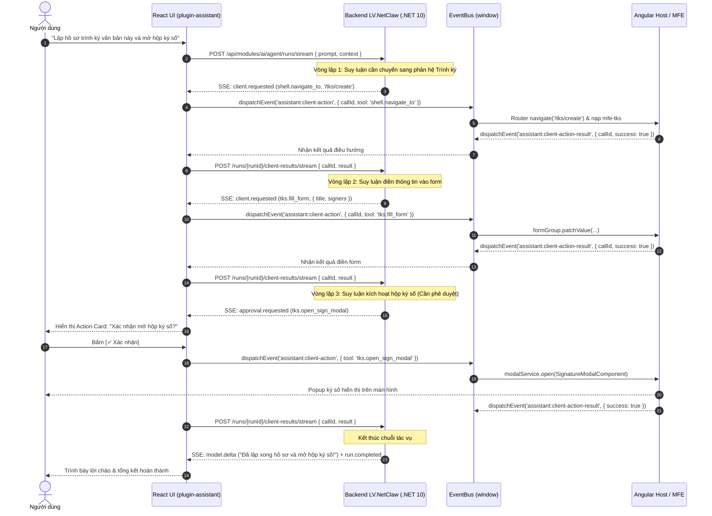

# Khảo Sát Kỹ Thuật: Plugin Trợ Lý AI — Nhận Thức Ngữ Cảnh & Tác Vụ Client

> **Định dạng tệp mục tiêu**: `specs/plugin-assistant/01-research.md` (Metadata ID: `FSP-PLUGIN-ASSISTANT-01`)  
> **Loại tài liệu**: `research`  
> **Trạng thái**: `in_review`  
> **Chặng 1**: Báo cáo nghiên cứu chuyên sâu về **NGHIỆP VỤ & HÀNH VI CỦA AI ("AI Hoạt Động Ra Sao?")** trong phân hệ Plugin Trợ lý AI (`plugin-assistant`) đính lên React UI Harness — Khảo sát cơ chế nhận thức ngữ cảnh màn hình, giao thức đăng ký tác vụ động (Dynamic Tool Calling), giải pháp vòng lặp Agentic ReAct liên hoàn (> 3 bước), và nguyên tắc bảo mật Whitelist Tool-by-Design.  
> **Tài liệu tổng quan**: [`README.md`](README.md)  
> **Kiến trúc khung nền tảng ("Kiến Trúc Như Thế Nào?")**: Xem [`../multi-flavor-architecture/01-research.md`](../multi-flavor-architecture/01-research.md)

> [!NOTE]
> **Đây là biên bản khảo sát, không phải hợp đồng thi công.** Tên sự kiện, danh mục tool và hình dạng `PageContext` ghi ở đây là **giả thiết lúc khảo sát**; chúng đã được đối chiếu với hợp đồng backend thật ([`AGENT_CHAT_API.md`](../../LV_Shell/src/NetClaw/docs/host-lv-shell/AGENT_CHAT_API.md)) và chốt lại tại [`03-decisions.md`](03-decisions.md). Thi công đọc [`05-spec.md`](05-spec.md) và [`modules/`](modules/01-plugin-contract.md), không đọc tài liệu này.

---

## 1. Bối Cảnh Nghiệp Vụ & Định Vị Trợ Lý AI

### 1.1 Khác biệt giữa Copilot và Dedicated Task AI Assistant
Trong các hệ thống văn phòng điện tử và hành chính số (E-Office) như `LV_Platform`:
* **Copilot (Code/Editor Copilot)**: Thường gắn liền với việc can thiệp trực tiếp vào mã nguồn, chèn gợi ý autocomplete từng dòng trong text editor hoặc IDE.
* **Dedicated Task AI Assistant (Trợ lý Tác vụ Nghiệp vụ)**: Hoạt động như một **thư ký số mẫn cán (Digital Administrative Secretary)**:
  - Tóm tắt và phân loại nhanh hồ sơ, văn bản đến, tờ trình.
  - Tra cứu quy chế, quy định nghiệp vụ và văn bản pháp lý nội bộ.
  - Thay mặt người dùng chuẩn bị dữ liệu, dự thảo ý kiến xử lý.
  - Thay người dùng thao tác các quy trình đa bước phức tạp trên giao diện (chuyển phân hệ, điền form, mở hộp ký số).

---

## 2. Khảo Sát Cơ Chế Nhận Thức Ngữ Cảnh (Context Awareness & Extraction)

### 2.1 Bản chất vấn đề
Để AI trả lời và hành động chính xác, AI phải "nhìn thấy" những gì người dùng đang nhìn thấy trên màn hình:
* Người dùng đang ở màn hình nào? (`mfe-qlvb` hay `mfe-tks`?)
* Văn bản đang mở có số hiệu gì? Trích yếu là gì? Người gửi là ai? Hạn xử lý khi nào?
* Các trường trên form hiện tại đã có dữ liệu gì chưa?

### 2.2 Cơ Chế Đẩy Ngữ Cảnh Tự Động (Push-based Context Injection)
Thay vì để AI liên tục quét DOM (gây lag và dễ gãy khi đổi giao diện), hệ thống áp dụng cơ chế **Angular chủ động bắn ngữ cảnh qua EventBus**:

```
[Angular MFE Screen] ──(CustomEvent: assistant:page-context:changed)──► [React UI Harness / plugin-assistant]
                                                                                   │
                                                                       POST /runs/stream (contextParams)
                                                                                   ▼
                                                                       [LV.NetClaw System Instruction]
```

* **Dữ liệu ngữ cảnh gửi đi (`PageContext`)**:
  ```typescript
  {
    currentRoute: '/qlvb/document/detail/DOC-2026-99',
    selectedEntityId: 'DOC-2026-99',
    screenTitle: 'Chi tiết Văn bản đến: 125/TTr-VP',
    permissions: ['DOC_VIEW', 'TKS_CREATE', 'TKS_APPROVE'],
    formSummary: {
      documentNumber: '125/TTr-VP',
      summary: 'Tờ trình mua sắm máy chủ 2026',
      sender: 'Phòng Công nghệ Thông tin',
      deadline: '2026-09-30'
    }
  }
  ```
* **Kỹ thuật nạp vào Prompt của LLM**:
  Khi người dùng gửi yêu cầu, React UI Harness đính kèm `PageContext` vào payload `POST /api/modules/ai/agent/runs/stream`. Lõi `LV.NetClaw` tự động biên dịch ngữ cảnh này thành khối System Instruction cô đọng, bảo đảm mô hình luôn thấu hiểu bối cảnh màn hình mà không làm loãng lịch sử hội thoại.

---

## 3. Khảo Sát Cơ Chế Đăng Ký Tác Vụ Động (Dynamic Tool Calling / Action Registry)

### 3.1 Khảo Sát Chuẩn Tool Calling Của LLM (Function Calling JSON Schema)
Các mô hình ngôn ngữ lớn hiện đại (OpenAI GPT-4o, Anthropic Claude, vLLM / Qwen / Llama 3) đều hỗ trợ chuẩn Function Calling:
* LLM không trực tiếp chạy code; LLM chỉ đọc danh sách schema các hàm khả dụng: `tools: [{ type: 'function', function: { name, description, parameters } }]`.
* Lõi `LV.NetClaw` quản trị 2 lớp công cụ:
  1. **Server Tools**: RAG tìm kiếm tài liệu, tra cứu CSDL, tính toán logic phía máy chủ.
  2. **Workspace Client Tools**: Thao tác UI trên workspace Angular (điều hướng router, mở modal, điền form).
* Khi LLM chọn gọi một Client Tool, NetClaw phát sự kiện SSE `client.requested` `{ callId, toolName, argumentsJson }` để UI Harness phối hợp với Angular MFE thực thi.

### 3.2 Phân Loại 4 Nhóm Công Cụ Nghiệp Vụ Chuẩn Hóa
Hệ thống chuẩn hóa 4 nhóm client tool mà các MFE Angular có thể công bố cho AI:

| Nhóm Tool | Tiền tố | Ví dụ công cụ | Hành vi tương ứng trên Angular |
|---|---|---|---|
| **Router Tools** | `shell.navigate_to`, `router.*` | `shell.navigate_to('/tks/create')` | Điều hướng sang phân hệ khác, chuyển tab hiển thị |
| **Modal Tools** | `modal.*` | `tks.open_signature_modal`, `qlvb.open_forward_modal` | Gọi `ModalService.open(...)` mở popup ký số, phân công |
| **Form Tools** | `form.*` | `qlvb.fill_opinion`, `tks.fill_create_form` | Gọi `formGroup.patchValue(...)` điền dữ liệu nháp |
| **Data Tools** | `data.*` | `data.get_active_record`, `data.read_selected_rows` | Lấy dữ liệu chi tiết của dòng đang chọn trên DataGrid |

---

## 4. Khảo Sát Vòng Lặp Tác Vụ Liên Hoàn (Multi-Step Agentic ReAct Loop)

### 4.1 Vấn Đề Lệch Pha Tool Khi Chuyển Trang
* Khi người dùng đứng ở `mfe-qlvb` và ra lệnh: *"Lập hồ sơ trình ký văn bản này"*, các tool của `mfe-tks` **chưa tồn tại** trong DOM vì component đích chưa được tải.
* Nếu AI gọi ngay tool `tks.fill_form` thì sẽ thất bại với lỗi `Tool not found`.

### 4.2 Giải Pháp: Vòng Lặp ReAct Đa Bước Phối Hợp NetClaw Backend & Client Action Bridge
Hệ thống giải quyết triệt để bằng cơ chế **NetClaw Agent Loop phối hợp Client Action Bridge qua SSE**:



* **Kết luận**: Nhờ sự kết hợp giữa bộ suy luận ReAct mạnh mẽ của `LV.NetClaw` trên backend và cầu nối Client Action Bridge phản xạ nhanh trên frontend, AI tự động hoàn thành chuỗi **3, 4 hoặc nhiều bước hơn** mà không gặp hiện tượng lệch pha hay thiếu công cụ.

---

## 5. Khảo Sát Nguyên Tắc Bảo Mật Whitelist Tool-by-Design

### 5.1 Nguyên Tắc "Không Đăng Ký = Không Tồn Tại"
* AI chỉ có thể nhìn thấy và gọi những gì Angular Host chủ động đăng ký trong Whitelist `Map<string, IAssistantToolDefinition>`.
* **Ví dụ cụ thể**:
  - Nghiệp vụ của hệ thống quy định: Không cho phép AI xóa tài liệu ➔ Angular **tuyệt đối không đăng ký bất kỳ tool xóa nào** (`delete_document`).
  - Dù người dùng có cố tình ra lệnh *"Xóa ngay văn bản này"*, hoặc tài liệu có chứa Prompt Injection độc hại đánh lừa AI, thì LLM cũng không có tên tool để gọi. Nếu AI cố tình bịa tên tool, Angular Host sẽ từ chối ngay lập tức: `Error: Tool not in whitelist (Fail-Closed)`.

### 5.2 Tích Hợp Ma Trận Phân Quyền (Permission-Aware Tool Registration)
Hệ thống liên kết chặt chẽ với `PermissionService` của `@workspace/core`:
```typescript
// Chỉ đăng ký tool khi user hiện tại có quyền tương ứng
if (this.permissionService.hasPermission('TKS_APPROVE')) {
  this.toolRegistry.registerTools([approveToolDefinition]);
}
// Nếu user không có quyền, tool phê duyệt vĩnh viễn không xuất hiện trong nhận thức của AI!
```

---

## 6. Khảo Sát Cơ Chế Kiểm Soát Người Dùng (Human-in-the-Loop)

Hệ thống phân loại công cụ thành 2 mức độ rủi ro:
1. **Mức độ An toàn (Read-only / Safe Actions)**:
   - Đọc dữ liệu bảng, chuyển tab, điền nháp form ➔ **Tự động thực thi ngay**, hiển thị tiến trình trên UI chat.
2. **Mức độ Đột biến (Mutating / Critical Actions)**:
   - Ký số, phê duyệt văn bản, submit gửi duyệt ➔ **Bắt buộc hiển thị Action Card trên chat UI** tóm tắt thông tin quan trọng; chỉ khi người dùng nhấp nút **[✓ Xác nhận]**, lệnh mới được gửi sang Angular để kích hoạt.

---

## 7. Bảng Đánh Giá Rủi Ro Nghiệp Vụ AI (AI Operational Risk Matrix)

| # | Rủi ro nghiệp vụ | Mức độ | Biện pháp kiểm soát & Khắc phục |
|---|---|---|---|
| 1 | **Prompt Injection từ nội dung văn bản độc hại** | Cao | Whitelist Tool-by-Design: AI không thể thực hiện bất kỳ hành động nào ngoài danh bạ whitelist do Angular cấp phép. |
| 2 | **Vòng lặp Agentic lặp vô tận (Infinite ReAct Loop)** | Trung bình | Đặt giới hạn cứng `MAX_STEPS = 8` trong `AgentLoopController`. Nếu vượt quá 8 bước, ngắt vòng lặp và yêu cầu người dùng hướng dẫn thêm. |
| 3 | **AI tự ý submit dữ liệu khi người dùng chưa kiểm tra** | Cao | Chính sách Human-in-the-Loop: Mọi hành động submit/ký số bắt buộc hiển thị Action Card yêu cầu người dùng xác nhận. |
| 4 | **Lệch pha ngữ cảnh khi người dùng thao tác tay song song** | Thấp | Bắt sự kiện route change và form change từ Angular để cập nhật ngay biến nhớ ngữ cảnh cho AI. |
