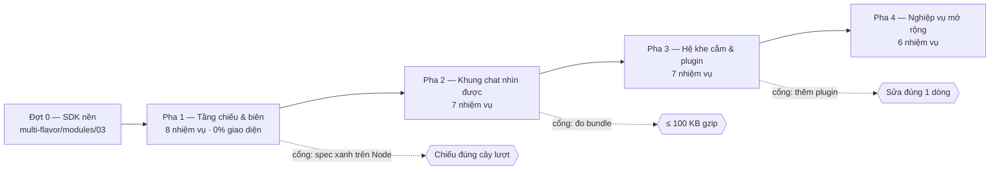

# Plugin Trợ Lý AI — Kế Hoạch Phân Kỳ & Phân Rã Công Việc

> **Định dạng tệp**: `specs/plugin-assistant/04-plan.md` (Metadata ID: `FSP-PLUGIN-ASSISTANT-04`)
> **Loại tài liệu**: `plan`
> **Trạng thái**: `draft`
> **Chặng 4**: Phân kỳ thi công bốn pha và phân rã công việc neo vào đặc tả. Mọi nhiệm vụ đều **đổ về một lượt port**, không phải một lượt thiết kế mới — [`QĐ-ASSISTANT-017`](03-decisions.md).
> **Sổ quyết định**: [`03-decisions.md`](03-decisions.md) · **Đặc tả**: [`05-spec.md`](05-spec.md) · **Chỉ mục**: [`index.md`](index.md)

---

## 1. Nguyên Tắc Phân Kỳ

Bốn pha dưới đây xếp theo **chiều phụ thuộc kỹ thuật**, không theo độ hấp dẫn của tính năng. Mỗi pha kết thúc bằng một cây mã **dựng được và kiểm được**; không pha nào để lại một nửa hợp đồng chờ pha sau.

| Nguyên tắc | Hệ quả lên thứ tự |
|---|---|
| **Kiểm được trước, nhìn được sau** | Tầng chiếu headless (0% React) đi trước mọi thẻ hiển thị — kiểm trên Node xong là yên tâm phần khó nhất |
| **Biên trước, nghiệp vụ sau** | `bridge/` có thật trước khi vẽ thẻ; vẽ thẻ trên dữ liệu giả là vẽ hai lần |
| **Khe cắm đi sau cùng** | Một khe chỉ có nghĩa khi đã có thứ để cắm; dựng khe trước là dựng một hợp đồng chưa ai dùng |
| **Port bằng phép trừ** | Mỗi nhiệm vụ là "chép tệp X về, gỡ N nhánh, đổi bảng Y", không phải "thiết kế lại X" |

**Phụ thuộc bên ngoài chặn Pha 1**: đợt port SDK nền của [`multi-flavor/modules/03`](../multi-flavor-architecture/modules/03-workbench-inheritance-map.md) phải xong trước. Thẻ hội thoại không dựng được khi chưa có `MarkdownViewer`, `ScrollView`, `Modal`, `focus-trap`.

---

## 2. Bốn Pha Thi Công

### Pha 1 — Tầng chiếu & biên (nền móng, không có giao diện)

**Mục tiêu**: một lượt chat thật chạy hết từ đầu đến cuối, nút hội thoại dựng đúng, **chưa vẽ gì lên màn hình**.

| Nhiệm vụ | Nội dung | Neo đặc tả |
|---|---|---|
| **P1.1** | Port hạng A `sdk/headless/sse-frame-parser.ts` + bài kiểm bốn ca biên (CR cuối chunk, `data:` nhiều dòng, `id:` chứa NUL, dòng `:`) | [`05-spec §5.3.2`](05-spec.md) · [`modules/03 §3.4`](modules/03-workbench-assistant-port-map.md) |
| **P1.2** | Port hạng B `bridge/netclaw-sse.bridge.ts`: giữ `#openStream`/`#pump`/`#dispatch`, **trừ** phương thức IDE, **đổi** bảng `switch` sang `$kind` | [`05-spec §5.3.3`](05-spec.md) |
| **P1.3** | Port hạng B `bridge/flavor-types.ts`: giữ DTO còn dùng, trừ ~40 DTO của IDE, thêm hai quy ước JSON | [`modules/03 §3.4`](modules/03-workbench-assistant-port-map.md) |
| **P1.4** | Port hạng B `bridge/reconnect-supervisor.ts`: giữ lùi dần, đổi phục hồi sang `GET runs/{id}` + `events?after=` | [`05-spec §5.1`](05-spec.md) |
| **P1.5** | Viết mới `bridge/workspace-event.bridge.ts`: sáu sự kiện biên, phép làm phẳng `PageContext`, `requestClientAction()` có hạn chờ | [`05-spec §3.2, §4.4`](05-spec.md) |
| **P1.6** | Port hạng B ba hàm chiếu `store/projection/`: `project-events` · `group-turns` · `collapse-exploration` | [`modules/02 §4`](modules/02-conversation-node-registry.md) |
| **P1.7** | Port hạng A/B bốn tiện ích chiếu: `turn-usage` · `markdown-parser` · `tool-arguments` · `running-work` | [`modules/03 §3.1`](modules/03-workbench-assistant-port-map.md) |
| **P1.8** | Port hạng B ba store: `assistant` · `approval` · `settings`; facade `store/use-assistant-run.ts` | [`05-spec §5.3.4`](05-spec.md) |

**Cổng ra Pha 1**: toàn bộ `store/projection/*.spec.ts` xanh trên Node; chạy một lượt chat thật, `console.table(turns)` in đúng cây lượt; rút mạng giữa lượt rồi `events?after=` dựng lại đủ.

### Pha 2 — Khung chat nhìn được

**Mục tiêu**: gửi được yêu cầu, thấy câu trả lời stream, cuộn neo đáy đúng.

| Nhiệm vụ | Nội dung | Neo đặc tả |
|---|---|---|
| **P2.1** | Port 16 thẻ C1–C16 + `ConversationNodeRegistry` (9 hạng A, 10 hạng B) | [`modules/02 §3.1`](modules/02-conversation-node-registry.md) · [`modules/03 §3.2`](modules/03-workbench-assistant-port-map.md) |
| **P2.2** | Port hạng B `views/chat/ConversationList.tsx`: thêm tra sổ widget, thêm `CardBoundary`, dùng `scroll-anchor` đã port | [`modules/03 §3.3`](modules/03-workbench-assistant-port-map.md) |
| **P2.3** | Port hạng B `views/chat/AgentTurnContainer.tsx`: đổi nguồn sang `TurnGroup` | [`modules/02 §3.2`](modules/02-conversation-node-registry.md) |
| **P2.4** | Port hạng B `components/composer/AssistantComposer.tsx`: **trừ bảy nhánh**, giữ ô co giãn, `usePasteHandler`, ba bảng neo, `matchLocalCommand` đồng bộ | [`modules/03 §3.3`](modules/03-workbench-assistant-port-map.md) |
| **P2.5** | Port hạng A năm tiện ích ô soạn: `AutocompletePopover` · `SlashSuggestPopup` · `ContextPill` · `usePopoverWidth` · `usePasteHandler` | [`modules/03 §3.3`](modules/03-workbench-assistant-port-map.md) |
| **P2.6** | Port hạng A/B `i18n/` ba tệp; thay nội dung `vi.ts` sang ngôn ngữ hành chính | [`modules/03 §3.6`](modules/03-workbench-assistant-port-map.md) |
| **P2.7** | Port hạng A hai hook trợ năng: `use-assistant-keyboard` (gắn vào Shadow Root) · `use-reduced-motion` | [`modules/03 §3.7`](modules/03-workbench-assistant-port-map.md) |

**Cổng ra Pha 2**: mọi `$kind` của [`modules/02 §4.2`](modules/02-conversation-node-registry.md) ra đúng thẻ; đo bundle khởi động ≤ 100 KB gzip.

### Pha 3 — Hệ khe cắm & plugin nghiệp vụ

**Mục tiêu**: thêm một năng lực mới chỉ sửa **đúng một dòng** ngoài thư mục plugin.

| Nhiệm vụ | Nội dung | Neo đặc tả |
|---|---|---|
| **P3.1** | Viết mới `slots/plugin-types.ts` + `slots/slot-registry.ts` + `slots/SlotBoundary.tsx` + `slots/use-slot.ts` | [`modules/01 §3`](modules/01-plugin-contract.md) |
| **P3.2** | Viết mới `slots/widget-registry.ts` theo `widgetKind`, có luật tiền tố và tên lõi không tiền tố | [`modules/01 §4.4`](modules/01-plugin-contract.md) |
| **P3.3** | Port hạng B `slots/contributed-commands.ts` từ `command-registry#L224-L300`: bốn phép kiểm fail-fast, hai sổ tách biệt | [`modules/01 §4.4`](modules/01-plugin-contract.md) |
| **P3.4** | Viết mới `plugins/registry.ts` (không có nguồn) | [`modules/01 §5.1`](modules/01-plugin-contract.md) |
| **P3.5** | Port hạng B `plugins/assistant/assistant-plugin.tsx`: giữ bốn nếp của bản gốc, trừ phần panel | [`modules/03 §3.5`](modules/03-workbench-assistant-port-map.md) |
| **P3.6** | Bộ render widget lõi: `todo-list` (C9) và `evidence-list`; `widgetKind` lạ ra JSON thu gọn | [`modules/02 §4.3`](modules/02-conversation-node-registry.md) |
| **P3.7** | Port hạng B `plugins/assistant/commands/dispatch.ts`: giữ bộ máy bốn kết cục và `/cost`, trừ lệnh IDE | [`modules/03 §3.5`](modules/03-workbench-assistant-port-map.md) |

**Cổng ra Pha 3**: chạy kịch bản [`modules/01 §5.3`](modules/01-plugin-contract.md) — thêm một plugin giả lập, `git diff --stat` cho thấy đúng **một** dòng sửa ngoài thư mục plugin mới.

### Pha 4 — Nghiệp vụ mở rộng & hoàn thiện

| Nhiệm vụ | Nội dung | Neo đặc tả |
|---|---|---|
| **P4.1** | `plugins/assistant/views/approvals/` — hộp thư phê duyệt, nạp lười, `keepAlive` | [`modules/01 §5.2`](modules/01-plugin-contract.md) |
| **P4.2** | Nút header kèm huy hiệu số lượng chờ duyệt | [`modules/01 §3.3`](modules/01-plugin-contract.md) |
| **P4.3** | Port hạng B `plugins/assistant/quick-starters.ts`: đổi **dữ liệu** sang nghiệp vụ hành chính | [`modules/03 §3.1`](modules/03-workbench-assistant-port-map.md) |
| **P4.4** | `plugins/settings/` — cài đặt giao diện, nạp lười | [`modules/01 §1.3`](modules/01-plugin-contract.md) |
| **P4.5** | Đo lại và chốt tám benchmark | [`README.md §8`](README.md) |
| **P4.6** | Ghi nhật ký cạm bẫy triển khai thực tế | [`06-verification.md §2`](06-verification.md) |

---

## 3. Bảng Phụ Thuộc Giữa Các Pha

**Ba việc chạy song song được với mọi pha** vì chúng không chạm mã của ai: `AssistantActionCatalog` phía Angular (thuộc `Angular_Workspace/`), hạ tầng build và triển khai flavor, và bộ dữ liệu kiểm thử mẫu.

---

## 4. Quy Ước Nhiệm Vụ Thi Công

Mỗi nhiệm vụ trong `tasks/` phải mang đủ bốn thứ, và thứ thứ tư là thứ hay thiếu nhất:

1. **Neo đặc tả** — trỏ tới đúng mục của `05-spec.md` hoặc `modules/*.md`.
2. **Hạng port + tệp nguồn kèm dải dòng** — với mọi nhiệm vụ port.
3. **Danh sách nhánh phải TRỪ** — liệt kê tường minh, không viết "gỡ phần không dùng".
4. **Bài kiểm phải port kèm** — port mã mà bỏ bài kiểm là bỏ đúng phần đã trả giá để có (`[INV-PORT-03]`).

**Mẫu một dòng nhiệm vụ:**

> `P2.4` — Port `AssistantComposer.tsx` (hạng B, nguồn `src/components/composer/AssistantComposer.tsx#L1-L1632`).
> **Trừ**: `ModelEffortSelector`, `ApprovalModeSelector`, `PathPickerPanel`, `path-picker.helper`, `ImageAttachmentChipList`, `MicButton`, `SkillActivationChip`, `git-context-snapshot` — cùng import của chúng.
> **Giữ**: ô co giãn, `usePasteHandler`, ba bảng neo qua `usePanelBand`, `matchLocalCommand()` đồng bộ trước `onSubmit`.
> **Bài kiểm**: port `tests/composer.spec.tsx`, bỏ ca của bảy nhánh đã trừ.
> **Neo**: [`modules/03 §3.3`](modules/03-workbench-assistant-port-map.md).

---

## 5. Rủi Ro Đã Nhận Diện & Cách Chặn

| Rủi ro | Dấu hiệu sớm | Cách chặn |
|---|---|---|
| **Người thi công gõ lại thay vì trừ** | Diff của một nhiệm vụ port không có dòng nào bị xóa, toàn dòng thêm | Bắt buộc khối chú thích nguồn gốc ghi rõ dải dòng; review đối chiếu với tệp nguồn |
| **Bundle vượt 100 KB ở Pha 2** | Báo cáo build vượt ~91 KB dự kiến | Đo sau **mỗi** nhiệm vụ Pha 2, không đo một lần cuối pha; biên chỉ còn ~9 KB |
| **Backend đổi `$kind` giữa chừng** | Thẻ trống hoặc nút không sinh ra | Nhánh mặc định `debug` của bảng chiếu đã chặn vỡ; đối chiếu lại `AGENT_CHAT_API.md` mỗi đầu pha |
| **`AssistantActionCatalog` chưa sẵn sàng** | `ui.navigate` luôn trả `isError` | Không chặn Pha 1–3; Pha 4 mới cần catalog thật. Trước đó dùng catalog giả có đúng hai route |
| **Tool ghi W1/W2 vẫn chưa mở ở vòng 1** | Không bao giờ thấy `approval.requested` | Thẻ C4 vẫn phải hiện thực và kiểm bằng sự kiện giả; **không** được chặn nghiệm thu vì lý do này |
| **Port thẻ IDE mà quên đổi ngữ nghĩa** | Thẻ C6/C7/C15 hiện thuật ngữ lập trình | Bốn thẻ đổi ngữ nghĩa được liệt kê đích danh ở [`modules/02 §3.1`](modules/02-conversation-node-registry.md); review đối chiếu |

---

## 6. Định Nghĩa Hoàn Tất Của Cả Feature

Feature chuyển `implemented` khi đủ **sáu** điều, không phải khi Pha 4 xong:

- [ ] Bốn pha xong, mỗi pha qua cổng ra của chính nó.
- [ ] Tám benchmark của [`README.md §8`](README.md) đo được và đạt ngưỡng.
- [ ] Mười hai luật kiểm-bằng-lệnh của [`ARCHITECTURE.md §7`](../../React_Assistant/ARCHITECTURE.md) chạy sạch.
- [ ] Bảy luật ranh giới plugin của [`modules/01 §6.3`](modules/01-plugin-contract.md) chạy sạch.
- [ ] [`06-verification.md`](06-verification.md) phần (b) — nhật ký cạm bẫy thực tế — **không rỗng** nếu quá trình thi công có sửa lỗi phát sinh.
- [ ] Mọi tệp port về mang khối chú thích nguồn gốc bốn dòng đúng khuôn [`modules/03 §4.6`](modules/03-workbench-assistant-port-map.md).
