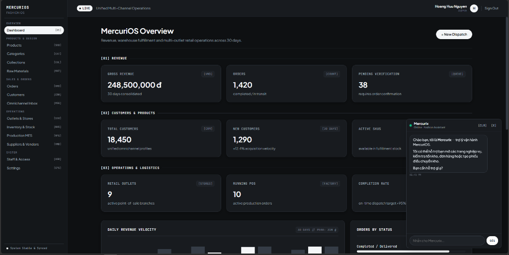
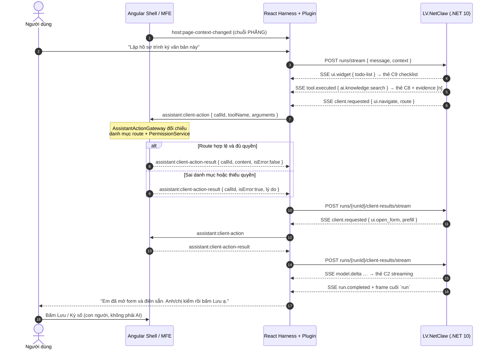

# Plugin Trợ Lý AI (React UI Assistant Plugin) — Cơ Chế Hoạt Động & Nghiệp Vụ

Tài liệu này là nguồn sự thật duy nhất (SSOT) trả lời hai câu hỏi ghép làm một: **"AI HOẠT ĐỘNG RA SAO?"** và **"NĂNG LỰC MỚI CẮM VÀO ĐÂU?"** trong phân hệ Plugin Trợ lý AI (`plugin-assistant`) — phần nghiệp vụ đính lên khung React Harness của hệ sinh thái `LV_Platform`.

> [!NOTE]
> - [ARCH] **Kiến trúc Khung Nền tảng ("Kiến Trúc Như Thế Nào?")**: Angular nhúng React qua Dual Root DOM, phong tỏa Shadow Root, ủy quyền API Gateway, xử lý vé dữ liệu lớn — xem [`../multi-flavor-architecture/README.md`](../multi-flavor-architecture/README.md).
> - [INDEX] **Chỉ mục Tiến độ & Bản đồ Mô-đun**: [`index.md`](index.md).
> - [ADR] **Sổ Quyết định Kiến trúc (17 `QĐ-ASSISTANT-xxx`)**: [`03-decisions.md`](03-decisions.md).

---



---

## 1. Tầm Nhìn Chiến Lược & Ba Tôn Chỉ Thiết Kế

**Tầm nhìn**: một **Thư ký số** biết người dùng đang đứng ở đâu trong hệ thống, làm hộ phần chuẩn bị, và luôn dừng lại trước nút bấm cuối cùng.

* **Định vị**: Trợ lý AI chuyên trách tác vụ hành chính, văn phòng số (**Dedicated Task AI Assistant**).
* **Không phải Copilot can thiệp mã**: AI không quét mã nguồn, không chạm trạng thái riêng tư của Angular, không can thiệp trình soạn thảo.
* **Bốn việc nó phục vụ**:
  1. Tóm tắt hồ sơ, văn bản đến, tờ trình, hợp đồng pháp lý.
  2. Tra cứu, hỏi đáp quy chế và quy trình nội bộ.
  3. Chuẩn bị dữ liệu, soạn dự thảo ý kiến xử lý.
  4. Chạy chuỗi tác vụ nghiệp vụ liên hoàn thay người dùng: điều hướng màn hình, mở biểu mẫu điền sẵn, gọi hộp thoại ký số.

**Ba tôn chỉ thiết kế**:

| # | Tôn chỉ | Ý nghĩa vận hành |
|:-:|---|---|
| **1** | **Con người bấm nút cuối cùng** | Giao diện mở form và điền sẵn; gửi, lưu, ký số, phê duyệt luôn là thao tác chủ động của người dùng |
| **2** | **Khung không biết nghiệp vụ, plugin không chạm biên** | Khung render thứ được đăng ký; plugin không `fetch`, không phát sự kiện ra Host, không đọc token |
| **3** | **Kế thừa bằng phép TRỪ, không bằng phép viết lại** | 55 tệp port từ gói `workbench.assistant` đã chạy thật, kèm bài kiểm. `workbench-ide` tự nó đã là một bản port đã tối ưu, nên mặc định là **lấy nguyên trạng rồi gỡ nhánh không dùng** — đọc logic rồi gõ lại là trả giá hai lần và nhận chất lượng thấp hơn |

---

## 2. Nguyên Lý Kiến Trúc Cốt Lõi

### 2.1 Bốn trụ cột hoạt động của AI

```
┌─────────────────────────────────────────────────────────────────────────────────┐
│                      4 TRỤ CỘT HOẠT ĐỘNG CỦA TRỢ LÝ AI                          │
├─────────────────────────┬─────────────────────────┬─────────────────────────────┤
│  1. NHẬN THỨC NGỮ CẢNH  │  2. CHỐT CHẶN HÀNH ĐỘNG │   3. VÒNG LẶP LIÊN HOÀN     │
│   (Context Awareness)   │  (Execution-Time Gate)  │    (Agentic ReAct Loop)     │
├─────────────────────────┼─────────────────────────┼─────────────────────────────┤
│ Host bắn ngữ cảnh màn   │ Model đề xuất route;    │ AI tự suy luận và thực thi  │
│ hình dạng CHUỖI PHẲNG   │ Angular Host đối chiếu  │ chuỗi hành động nhiều bước: │
│ (module, route, mã văn  │ danh mục + quyền rồi    │ Điều hướng ➔ Điền form ➔    │
│ bản, trích yếu, vùng    │ mới chạm Router. Sai    │ Người dùng bấm ➔ Agent kết  │
│ bôi đen) vào mỗi lượt.  │ thì từ chối CÓ LÝ DO.   │ luận.                       │
├─────────────────────────┴─────────────────────────┴─────────────────────────────┤
│                          4. KIỂM SOÁT AN TOÀN & PHÊ DUYỆT                       │
│                               (Human-in-the-Loop)                               │
│  - Thao tác an toàn (đọc dữ liệu, đổi tab): Tự động chạy ngay.                  │
│  - Thao tác đột biến (submit, ký số, phê duyệt): Bắt buộc người dùng bấm duyệt. │
└─────────────────────────────────────────────────────────────────────────────────┘
```

> [!NOTE]
> **Hiện trạng vòng 1 của backend**: tool ghi (W1/W2) **chưa được mở**. Mọi hành động ghi đi qua form điền sẵn để người dùng tự bấm, nên luồng `approval.requested` tuy đã có đủ trong kernel vẫn chưa được kích hoạt trên thực tế. Giao diện vẫn phải hiện thực đúng luồng duyệt, nhưng không được coi nó là đường đi chính của giai đoạn đầu, và không được chặn nghiệm thu vì "chưa thấy thẻ duyệt nào".

### 2.2 Ba tầng sở hữu mã nguồn

| Tầng | Sở hữu gì | Đổi khi nào |
|---|---|---|
| **Khung** (`harness/`, `slots/`, `bridge/`, `store/`, `views/chat/`, `components/`) | Ngăn kéo, ba khe cắm, bộ đọc SSE, phép chiếu sự kiện, 16 thẻ hội thoại dựng sẵn | Khi đổi bố cục hoặc đổi hợp đồng với Host |
| **Plugin** (`plugins/<id>/`) | Bộ render widget theo `widgetKind`, view chuyên sâu nạp lười, nút header, thẻ hội thoại đóng góp thêm | Khi nghiệp vụ mở rộng |
| **Backend** (`LV.NetClaw`) | 100% vòng lặp ReAct, chọn tool, RAG, nén ngữ cảnh, streaming | Ngoài phạm vi repo giao diện |

Ranh giới đọc được bằng một câu: **khung biết hình dạng của một sự kiện; plugin biết ý nghĩa nghiệp vụ của nó.**

### 2.3 Ba khe cắm chuẩn

| Khe | Plugin đăng ký gì | Khung render ở đâu |
|---|---|---|
| `slot:header.actions` | Nút icon + tooltip + huy hiệu + `order` | Hàng nút bên phải `HeaderToolbar` |
| `slot:main.view` | `React.lazy` component + `viewId` + `keepAlive` | `MainViewHost`, thay chỗ khung chat |
| `slot:chat.widget` | Bộ render theo `widgetKind` của sự kiện `ui.widget` | Trong dòng, giữa danh sách hội thoại |

Hợp đồng đầy đủ: [`modules/01-plugin-contract.md`](modules/01-plugin-contract.md).

---

## 3. Sơ Đồ Vận Hành



---

## 4. Tech Stack Chốt Chính Thức

| Lớp | Công nghệ | Ghi chú ràng buộc |
|---|---|---|
| Giao diện | React 19 + TypeScript strict (`exactOptionalPropertyTypes`) | Mount trong Shadow Root do Angular Shell cấp |
| Trạng thái | Zustand — **store mỏng**, chỉ giữ ảnh chụp phẳng | Thuật toán nằm ở `store/projection/`, không nằm trong store |
| Định kiểu | Tailwind CSS v4 biên dịch vào Shadow Root; token M3 khai tại `:host` | Không một dòng CSS nào ở `<head>` toàn cục |
| Truyền tải | `fetch` + `ReadableStream` đọc SSE ngắn hạn theo lượt | Không WebSocket, không kênh SSE thông báo thứ hai |
| Đóng gói | Vite chế độ thư viện — một JS + một CSS | Bundle khởi động **≤ 100 KB gzip** |
| Backend | `LV.NetClaw` trên `LV.Shell.Modules.AI` (.NET 10) | Độc quyền vòng lặp ReAct |
| Nguồn kế thừa | Gói `workbench.assistant` trong `.reference/workbench-ide/` | Port, **không** phụ thuộc |

---

## 5. Ma Trận Đánh Đổi

| Hạng mục thiết kế | Lợi ích đạt được | Đánh đổi chấp nhận |
|---|---|---|
| **Vòng lặp ReAct 100% ở backend** | Giao diện không bao giờ giữ khóa API, không chạy logic tác tử; đổi model không phải phát hành lại giao diện | Mọi năng lực mới đều chờ backend mở tool; giao diện không "tự chế" được hành vi |
| **Chốt chặn lúc thực thi (không phải lúc đăng ký)** | Quyền người dùng đổi giữa phiên vẫn được tôn trọng; chống Prompt Injection ở đúng chỗ cuối cùng | Model **vẫn đề xuất được** route không tồn tại; phải trả lý do từ chối ngược lên hội thoại để agent nói lại |
| **Plugin là đơn vị tổ chức mã, không phải đơn vị phân phối** | Không sandbox, không `new Function()`, không CSP đặc biệt; gãy hợp đồng là build đỏ chứ không phải lỗi lúc chạy | Không cắm được plugin của bên thứ ba sau khi phát hành; thêm năng lực phải dựng lại bundle |
| **Ba khe tĩnh thay cho `SlotCore` 4 hạng** | Gõ sai khe không biên dịch được; không máy trạng thái fiber, không hoà giải phụ thuộc | Mất `chain` (tự ứng cử theo props) — chưa có ca dùng nào |
| **Port 55 tệp bằng phép trừ, 0 tệp viết mới** | Thuật toán đã qua ca biên thật, có bài kiểm đi kèm. Ví dụ đắt nhất: bộ tách khung SSE chuẩn W3C xử đúng ca CR cuối chunk — thứ một bản tự viết hỏng im lặng | Phải đọc kỹ tệp nguồn trước khi xếp hạng; độ dài tệp **không** phải căn cứ. Phải giữ kỷ luật ghi nguồn gốc và chạy bài kiểm sau mỗi lượt trừ |
| **Ngân sách 100 KB gzip là trần cứng** | Trợ lý không làm chậm chính màn hình nghiệp vụ nó phục vụ | Ghi âm giọng nói, lịch sử hội thoại, so sánh nhiều tệp đều lùi sang vòng sau |

---

## 6. Các Bất Biến Nghiệp Vụ Của Trợ Lý AI (`[INV-ASSISTANT-*]`)

1. **`[INV-ASSISTANT-01]` Chốt Chặn Hành Động Lúc Thực Thi (Execution-Time Action Gate)**: Backend `LV.NetClaw` khai **hai client tool tĩnh** là `ui.open_form` và `ui.navigate`, trong đó `route` là chuỗi tự do do model sinh ra. Vì vậy điểm kiểm soát nằm ở Angular Host: `AssistantActionGateway` đối chiếu route/form với danh mục hợp lệ của màn hình hiện tại trước khi chạm Router, sai thì từ chối (Fail-Closed) kèm lý do để agent nói lại với người dùng.
2. **`[INV-ASSISTANT-02]` Không Có Trong Danh Mục = Không Làm Được**: Năng lực nào không nằm trong `AssistantActionCatalog` thì AI không có đường thực thi — dù người dùng yêu cầu hay bị Prompt Injection. Điều quan trọng cần hiểu đúng: model **vẫn có thể đề xuất** một route không tồn tại; cái bị chặn là **việc thực thi**, không phải việc đề xuất.
3. **`[INV-ASSISTANT-03]` Tích Hợp Ma Trận Phân Quyền (Permission-Aware Guard)**: Mỗi mục trong danh mục hành động gắn một policy; Host kiểm `PermissionService.hasPermission()` của `@workspace/core` tại thời điểm **thực thi**, không phải tại thời điểm đăng ký — quyền của người dùng có thể đổi giữa phiên.
4. **`[INV-ASSISTANT-04]` Vòng Lặp Có Chờ Đợi (Awaitable Client Action)**: Backend giữ run ở trạng thái `WaitingClient` cho tới khi Angular trả kết quả qua `POST runs/{runId}/client-results/stream`. Mỗi `callId` nhận **đúng một** kết quả và **luôn phải có** kết quả: nuốt một `callId` sẽ treo hội thoại cho tới khi người dùng tự huỷ.
5. **`[INV-ASSISTANT-05]` Kiểm Soát Đột Biến Dữ Liệu (Mutation Confirmation Mandate)**: Các tool làm thay đổi dữ liệu nhạy cảm bắt buộc phải hiển thị `ToolApprovalCard` (thẻ C4) trên chat UI để người dùng chủ động bấm xác nhận.
6. **`[INV-ASSISTANT-06]` Zero Unauthorized Persistence**: Trợ lý không tự lưu nội dung văn bản mật hay thông tin người dùng vào kho bền vững nào. Token chỉ sống trong bộ nhớ và bị xóa khi nhận `host:auth-revoked`.
7. **`[INV-ASSISTANT-07]` Quyền Lực Vòng Lặp Thuộc 100% Về Backend (Backend ReAct Engine Authority)**: 100% vòng lặp ReAct, lưu trữ ngữ cảnh hội thoại, lựa chọn công cụ và streaming mô hình thuộc về `LV.NetClaw` trên backend .NET 10.
8. **`[INV-ASSISTANT-08]` Đóng Gói UI Plugin Độc Lập Theo Khe Cắm (Slot-Based UI Extensibility)**: Năng lực mở rộng đăng ký vào ba khe `slot:header.actions` · `slot:main.view` · `slot:chat.widget`. Khung **không biết** plugin nào tồn tại; thêm một năng lực không sửa một tệp nào của khung, ngoài đúng một dòng trong `plugins/registry.ts`.
9. **`[INV-ASSISTANT-09]` Ngữ Cảnh Trên Dây Là Chuỗi Phẳng (Flat Wire Context)**: `context` gửi lên backend là `Record<string, string>` — không object lồng, không mảng. Cấu trúc giàu kiểu chỉ sống trong bộ nhớ Guest và được làm phẳng tại `bridge/` trước khi gửi.
10. **`[INV-ASSISTANT-10]` Sự Kiện Lạ Không Được Gây Lỗi (Forward-Compatible Rendering)**: `$kind` hoặc `widgetKind` chưa biết thì bỏ qua hoặc render thu gọn, và luồng chạy tiếp. Backend được quyền thêm loại sự kiện mà không làm vỡ giao diện đã phát hành.
11. **`[INV-ASSISTANT-11]` Plugin Không Chạm Biên (Plugin Boundary Isolation)**: Plugin không `fetch`, không `window.dispatchEvent`, không đọc `localStorage`, không ghép URL API, không `createPortal` ra ngoài Shadow Root. Mọi đường ra biên đi qua `src/bridge/`.
12. **`[INV-ASSISTANT-12]` Port Chứ Không Phụ Thuộc (Port, Not Depend)**: Mã kế thừa được **chép về** thành tài nguyên của `React_Assistant/` kèm khối chú thích nguồn gốc. Cấm khai `.reference/` làm dependency, cấm path alias, cấm import xuyên ranh giới repo.
13. **`[INV-ASSISTANT-13]` Port Bằng Phép Trừ (Subtractive Port)**: Mặc định của mọi tệp kế thừa là **lấy nguyên trạng rồi tối ưu tại chỗ** — gỡ nhánh không dùng, đổi tên miền nghiệp vụ, nối lại điểm biên. Gõ lại từ trang trắng một tệp đã có là vi phạm, kể cả khi bản gõ lại ngắn hơn. Độ dài tệp **không** phải căn cứ phân hạng.

---

## 7. Non-Goals & Anti-Patterns

### 7.1 Ngoài phạm vi (Non-Goals)

* **Không phải trợ lý lập trình**: không đọc mã nguồn, không nhúng Monaco, không chạy terminal, không thao tác Git.
* **Không chạy vòng lặp agent ở trình duyệt**: không gọi thẳng LLM, không tự chọn tool, không tự nén ngữ cảnh.
* **Không phải cổng quản trị AI**: cấu hình nhà cung cấp model, ngân sách token, chỉ mục tri thức thuộc `mfe-ai` phía Angular.
* **Không nạp plugin của bên thứ ba lúc chạy**: không sandbox, không biên dịch TSX trong trình duyệt, không quét thư mục.
* **Không giữ danh tính**: không OIDC, không tự làm mới token, không kho lưu trữ bền vững.

### 7.2 Anti-Patterns — làm là sai, không phải tùy phong cách

| Anti-pattern | Vì sao sai | Làm đúng là |
|---|---|---|
| Dò chuỗi trong câu trả lời model để kích hoạt hành vi | Vỡ ngay khi đổi model hoặc đổi nhiệt độ | Chỉ phản ứng với sự kiện **có cấu trúc** (`client.requested`, `ui.widget`, `approval.requested`) |
| Gửi `context` lồng object lên backend | Backend nhận `Dictionary<string,string>`; dữ liệu mất im lặng | Làm phẳng tại `bridge/` — `[INV-ASSISTANT-09]` |
| Plugin tự `fetch` để lấy dữ liệu riêng | Là một client thứ hai không ai kiểm soát, không ai gắn được token đúng | Gọi facade hook của `bridge/` — `[INV-ASSISTANT-11]` |
| Đăng ký danh bạ tool từ Angular và tin rằng model chỉ thấy danh bạ đó | Model không bao giờ nhìn thấy danh bạ ấy; chỉ có hai tool tĩnh | Chốt chặn **lúc thực thi** ở `AssistantActionGateway` — `[INV-ASSISTANT-01]` |
| Ném khi gặp `$kind` lạ | Một lần backend thêm loại sự kiện là một lần Trợ lý chết trắng màn hình | Bỏ qua, ghi `debug`, đi tiếp — `[INV-ASSISTANT-10]` |
| Nhồi view cấu hình vào ngăn kéo 420px | Bố cục vỡ, bảng nhiều cột không đọc được | Chiếu lên tầng Modal Portal 800–1000px qua `ctx.openModal()` |
| Mở kênh SSE thường trực thứ hai cho thông báo | Trình duyệt giới hạn 6 kết nối mỗi domain | Badge và thông báo là việc của Angular Shell trên kênh nền tảng |
| `import` xuyên `.reference/` | Build xanh trên máy người viết, đỏ trên CI | Port một bản về `src/` kèm chú thích nguồn gốc — `[INV-ASSISTANT-12]` |
| Đọc tệp nguồn rồi gõ lại từ trang trắng vì thấy nó "dài quá" | `workbench-ide` đã là bản port đã tối ưu; gõ lại là bỏ mọi ca biên đã trả giá. Bộ tách SSE tự viết hỏng im lặng ở ca CR cuối chunk | Chép nguyên rồi **trừ** nhánh không dùng, chạy bài kiểm sau mỗi lượt trừ — `[INV-ASSISTANT-13]` |

---

## 8. Benchmarks Kiểm Chứng

| # | Chỉ tiêu | Ngưỡng | Cách đo |
|:-:|---|---|---|
| 1 | Bundle khởi động | ≤ **100 KB** gzip | Báo cáo build của Vite sau `npm run build` |
| 2 | Thời gian từ `mountFlavor()` tới khung chat hiện | ≤ **300 ms** | `performance.mark` trong `main.tsx`, đo trên máy tầm trung |
| 3 | Độ trễ từ khung SSE tới chữ hiện trên màn hình | ≤ **50 ms** | Dấu thời gian `at` của sự kiện so với `performance.now()` lúc commit |
| 4 | Chiếu lại 500 sự kiện (`projectEvents`) | ≤ **16 ms** | Bench Vitest chạy Node, không cần trình duyệt |
| 5 | Vòng đời đối xứng | **0** listener, 0 stream, 0 timer còn lại sau 10 lượt mount ⇄ dispose | Bài kiểm tích hợp đếm tài nguyên |
| 6 | Sự kiện lạ | **0** lỗi khi nạp một chuỗi có 5 `$kind` bịa | Bài kiểm của `projectEvents` |
| 7 | Cách ly plugin | Một plugin ném trong `activate()` ⇒ các plugin còn lại vẫn kích hoạt đủ | Bài kiểm của `slot-registry` |
| 8 | Thêm một plugin | Sửa đúng **1** dòng ngoài thư mục plugin mới | Rà `git diff --stat` của lượt thêm |

---

## 9. Lộ Trình FSP 6 Chặng

| Chặng | Tệp | Trạng thái | Nội dung |
|:-:|---|:-:|---|
| **1** | [`01-research.md`](01-research.md) | `in_review` | Khảo sát: nhận thức ngữ cảnh, Dynamic Tool Calling, vòng lặp ReAct đa bước |
| **2** | [`02-rfc.md`](02-rfc.md) | `in_review` | Đề xuất giao thức điều phối và chính sách Human-in-the-Loop |
| **3** | [`03-decisions.md`](03-decisions.md) | `draft` | **17 quyết định `QĐ-ASSISTANT-001..017`** gỡ toàn bộ điểm vướng mắc |
| **4** | [`04-plan.md`](04-plan.md) | `draft` | Phân kỳ bốn pha, 28 nhiệm vụ neo vào đặc tả, sáu rủi ro đã chặn |
| **5** | [`05-spec.md`](05-spec.md) + [`modules/`](modules/01-plugin-contract.md) | `draft` | Hợp đồng kỹ thuật: `PageContext`, client action, SSE, ba mô-đun chuyên sâu |
| **6** | [`06-verification.md`](06-verification.md) | `draft` | Ma trận kiểm thử bốn tầng T1–T4 và nhật ký cạm bẫy triển khai thực tế |

### Ba mô-đun chuyên sâu

| Mô-đun | Trả lời câu hỏi |
|---|---|
| [`modules/01-plugin-contract.md`](modules/01-plugin-contract.md) | *Tôi cắm năng lực mới vào đâu, trả về gì, gỡ ra sao?* |
| [`modules/02-conversation-node-registry.md`](modules/02-conversation-node-registry.md) | *Sự kiện nào ra thẻ nào, và luật đó kiểm ở đâu?* |
| [`modules/03-workbench-assistant-port-map.md`](modules/03-workbench-assistant-port-map.md) | *Kéo mã về từ đâu, hạng nào, phải chỉnh chỗ nào?* |

---

## 10. Tài Liệu Tham Chiếu Liên Quan

| Chủ đề | Tài liệu |
|---|---|
| Hợp đồng API backend (`$kind`, hai quy ước JSON, `ui.widget`) | [`AGENT_CHAT_API.md`](../../LV_Shell/src/NetClaw/docs/host-lv-shell/AGENT_CHAT_API.md) |
| Kiến trúc Host ↔ Guest, Shadow Root, handshake | [`../multi-flavor-architecture/README.md`](../multi-flavor-architecture/README.md) |
| Đặc tả khung giao diện Trợ lý | [`../multi-flavor-architecture/modules/01-react-assistant-harness.md`](../multi-flavor-architecture/modules/01-react-assistant-harness.md) |
| Hợp đồng token giao diện M3 | [`../multi-flavor-architecture/modules/02-ui-token-contract.md`](../multi-flavor-architecture/modules/02-ui-token-contract.md) |
| Bản đồ kế thừa **vỏ** React (SDK, khung màn hình) | [`../multi-flavor-architecture/modules/03-workbench-inheritance-map.md`](../multi-flavor-architecture/modules/03-workbench-inheritance-map.md) |
| Luật bất biến của repo thi công | [`React_Assistant/CLAUDE.md`](../../React_Assistant/CLAUDE.md) · [`ARCHITECTURE.md`](../../React_Assistant/ARCHITECTURE.md) |
| Quy chuẩn kho tham chiếu OSS | [`.reference/README.md`](../../.reference/README.md) |
