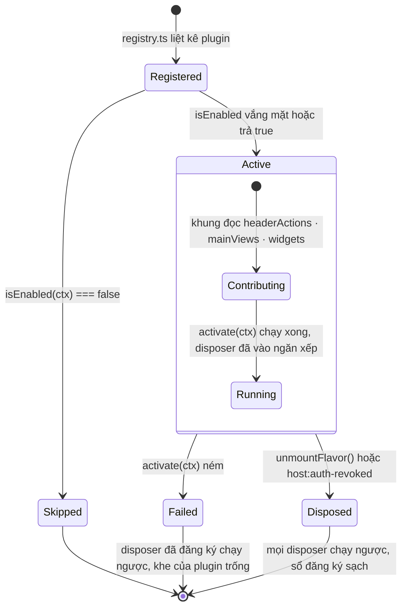
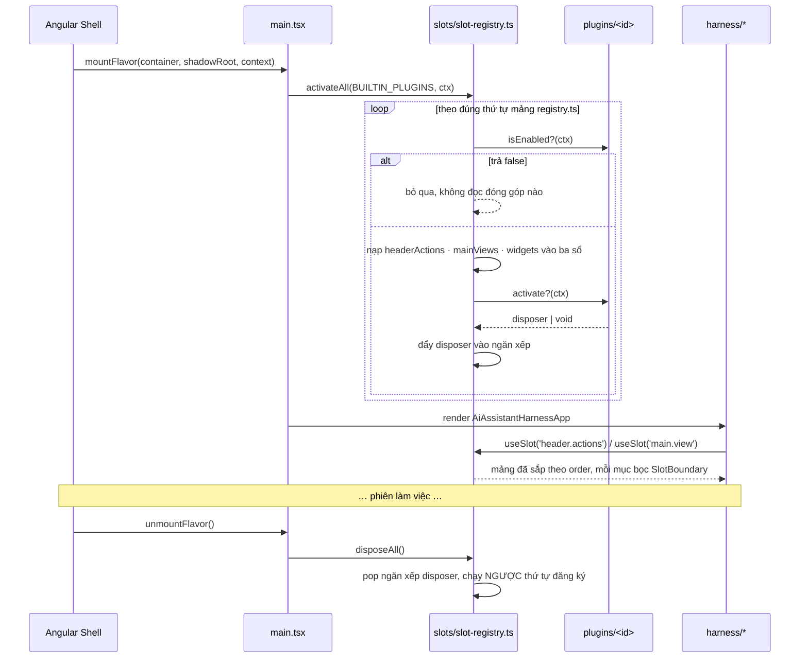
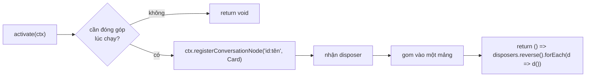

# Plugin Trợ Lý AI Module 01: Hợp Đồng Plugin & Hệ Khe Cắm

> **Định dạng tệp**: `specs/plugin-assistant/modules/01-plugin-contract.md` (Metadata ID: `FSP-PLUGIN-ASSISTANT-MOD-01`)
> **Loại tài liệu**: `spec-module`
> **Trạng thái**: `draft`
> **Mã Quyết định**: [`QĐ-ASSISTANT-001`](../03-decisions.md) · `002` · `003` · `004` · `011` · `012` · `013`
> **Căn cứ Mã nguồn Tham chiếu**: `.reference/workbench-ide/apps/react/src/evaluator/plugin-types.ts#L1-L81` · `slot-core.ts#L23-L179` · `plugin-microkernel.ts#L98-L353` · `resources/plugins/workbench.document-intelligence/frontend/src/index.tsx#L96-L152`
> **Nguyên tắc**: Zero-Interpolation — tài liệu này tự chứa 100% logic; kho tham chiếu chỉ cần khi muốn đọc chi tiết cài đặt.
> **Đặc tả chung**: [`../05-spec.md`](../05-spec.md) · **Bản đồ port**: [`03-workbench-assistant-port-map.md`](03-workbench-assistant-port-map.md)

---

## 1. Bản Chất & Động Lực Kỹ Thuật

### 1.1 Bài toán giải quyết

Khung Trợ lý phải giữ **một** giao diện hội thoại thống nhất trong khi năng lực mở rộng thì mọc thêm liên tục: hộp thư phê duyệt, so sánh văn bản, thư viện câu lệnh, cài đặt, và các widget động do chính backend phát ra qua `ui.widget` mà hôm nay chưa ai biết tên.

Nhồi hết vào khung cho ra hai hậu quả đo được:

1. **Bundle khởi động phình vượt ngân sách 100KB gzip** — ràng buộc cứng của [`QĐ-ASSISTANT-013`](../03-decisions.md), vì Trợ lý nạp trên chính tab người dùng đang làm việc, cạnh một MFE Angular đã tải.
2. **Mỗi lần thêm một năng lực là một lần sửa vào tệp gốc của khung** — `HeaderToolbar.tsx` mọc thêm một nút, `ConversationList.tsx` mọc thêm một nhánh `if`, và sau mười lần thì không ai dám sửa hai tệp đó nữa.

Hệ khe cắm đảo ngược chiều phụ thuộc: **khung không biết plugin nào tồn tại**, nó chỉ mở ba khe và render những gì được đăng ký.

### 1.2 Rủi ro nếu gộp vào spec chung

Hợp đồng plugin là thứ **mọi plugin tương lai đọc trước khi viết dòng đầu tiên**. Để nó nằm rải trong `05-spec.md` giữa các mục về SSE và ngữ cảnh màn hình nghĩa là người viết plugin thứ tư phải đọc lại toàn bộ nghiệp vụ AI để tìm ra chữ ký của `activate()`. Tách ra là để câu hỏi *"tôi cắm vào đâu, trả về gì, gỡ ra sao"* có đúng một chỗ trả lời.

### 1.3 Ranh giới sở hữu: Khung ≠ Plugin

> Chốt tại [`QĐ-ASSISTANT-004`](../03-decisions.md). Đây là ranh giới hay bị vẽ sai nhất.

| Hạng mục | Chủ sở hữu | Vị trí trong `React_Assistant/src/` |
|---|---|---|
| Ngăn kéo, header, dải trạng thái, banner, `ModalPortal` | **Khung** | `harness/`, `components/modal/` |
| Cơ chế khe cắm: sổ đăng ký, kiểu, `SlotBoundary`, hook đọc khe | **Khung** | `slots/` |
| Khung chat mặc định (danh sách hội thoại, ô soạn hai tầng) | **Khung** | `views/chat/`, `components/composer/` |
| Sổ 16 thẻ hội thoại dựng sẵn C1–C16 | **Khung** | `components/cards/` |
| Bộ đọc SSE, cầu nối sự kiện với Angular Host, phép chiếu sự kiện ➔ nút | **Khung** | `bridge/`, `store/` |
| Bộ render widget theo `widgetKind` | **Plugin** | `plugins/<id>/widgets/` |
| View chuyên sâu nạp lười (hộp thư duyệt, so sánh văn bản, cài đặt) | **Plugin** | `plugins/<id>/views/` |
| Nút icon trên header kèm huy hiệu | **Plugin** | `plugins/<id>/<id>-plugin.ts` |
| Thẻ hội thoại **đóng góp thêm** ngoài 16 thẻ dựng sẵn | **Plugin** | `plugins/<id>/cards/` |

Ranh giới đọc được bằng một câu: **khung biết hình dạng của một sự kiện; plugin biết ý nghĩa nghiệp vụ của nó.** Khung render được một `ui.widget` lạ (thành JSON thu gọn) mà không cần biết `widgetKind` ấy nghĩa là gì; plugin là nơi biến nó thành một bảng tiến độ.

### 1.4 Ranh giới phạm vi

* **Trong phạm vi**: định nghĩa ba khe, hợp đồng `IUiPlugin` và `IPluginContext`, vòng đời kích hoạt/gỡ bỏ, luật đặt tên đóng góp, ranh giới chặn lỗi, ma trận ca biên.
* **Ngoài phạm vi**: ma trận sự kiện ➔ thẻ và hợp đồng `ui.widget` (thuộc [mô-đun 02](02-conversation-node-registry.md)); danh mục tệp port và dải dòng trích dẫn (thuộc [mô-đun 03](03-workbench-assistant-port-map.md)); bố cục ngăn kéo và tầng modal (thuộc [`multi-flavor/modules/01`](../../multi-flavor-architecture/modules/01-react-assistant-harness.md)); giá trị token giao diện (thuộc [`multi-flavor/modules/02`](../../multi-flavor-architecture/modules/02-ui-token-contract.md)).

### 1.5 Ba thứ của mã tham chiếu cố ý KHÔNG lấy

| Cơ chế trong kho tham chiếu | Vì sao nó tồn tại ở đó | Vì sao nó KHÔNG cần ở đây |
|---|---|---|
| Trình nạp Dual-Mode: biên dịch TSX trong RAM rồi chạy trong `new Function()`, Virtual Module Map làm danh sách trắng `require()` | IDE cho phép người dùng tự đặt gói vào `~/.workbench/plugins/` — mã đến từ ngoài lúc chạy | Trợ lý chạy trong tab của nền tảng doanh nghiệp đã đăng nhập. Tập plugin là một mảng hằng biết lúc biên dịch, nên không có mã nào cần dịch lúc chạy — và một cơ chế chạy mã tùy ý ở đây là lỗ hổng, không phải tính năng |
| `PluginMicrokernel`: 6 pha fiber (`PENDING`/`LOADING`/`ACTIVE`/`UNLOADING`/`DISPOSED`/`FAILED`), hoà giải phụ thuộc lặp tới điểm bất động, dò chu trình | Thứ tự nạp các gói phát hành độc lập không biết trước; một gói có thể xuất hiện sau gói tiêu thụ nó | Thứ tự kích hoạt **là** thứ tự mảng trong `registry.ts`, do người viết xếp tay và kiểm bằng typecheck. Nuôi một máy trạng thái 6 pha để giải một bài toán đã bị loại bỏ là chi phí thuần |
| `SlotCore` 4 hạng + `declareSlot()` + `UndeclaredSlotError` + cascading teardown theo `parentRegistrationId` | `slotId` là chuỗi tự do do gói bên thứ ba tự đặt, nên phải có kỷ luật khai báo trước | Ba khe là ba trường có kiểu trên `IUiPlugin`. Một khe gõ sai không biên dịch được — sớm hơn hẳn một `UndeclaredSlotError` lúc chạy |

> Căn cứ Mã nguồn: `.reference/workbench-ide/apps/react/src/evaluator/plugin-loader.ts#L234-L253` (`SecurityViolationError`) · `plugin-microkernel.ts#L188-L214` (`reconcileDependencies`) · `slot-core.ts#L44-L129` (`register` 4 hạng)

---

## 2. Máy Trạng Thái & Luồng Dữ Liệu

### 2.1 Vòng đời một plugin

Bốn trạng thái, không phải sáu. Không có `PENDING` vì không có gì để chờ; không có `UNLOADING` riêng vì lượt gỡ là đồng bộ và không thể hỏng nửa chừng (mỗi disposer tự bọc `try/catch`).



| Cạnh | Ai đặt | Điều kiện | Hệ quả quan sát được |
|---|---|---|---|
| `Registered ➔ Skipped` | `slot-registry.ts` | `isEnabled(ctx)` trả `false` | **Không chunk nào được tải.** Nút header không hiện, `mainViews` không vào danh mục |
| `Registered ➔ Active` | `slot-registry.ts` | Mặc định | Ba sổ đóng góp nhận mục của plugin |
| `Active ➔ Failed` | `slot-registry.ts` | `activate(ctx)` ném | Chạy ngược disposer đã kịp đăng ký, ghi lỗi, **tiếp tục sang plugin kế tiếp** |
| `Active ➔ Disposed` | `slot-registry.ts` | `unmountFlavor()` | Toàn bộ disposer chạy ngược thứ tự đăng ký |

### 2.2 Luồng một lượt mount đầy đủ



### 2.3 Luồng đóng góp động lúc chạy

Ba trường khai báo (`headerActions`, `mainViews`, `widgets`) là **tĩnh**: khung đọc chúng một lần lúc kích hoạt. Thứ cần đăng ký **lúc chạy** — một thẻ hội thoại mới, một lệnh gạch chéo — đi qua `ctx` và bắt buộc trả disposer:



---

## 3. Lược Đồ Dữ Liệu & Hợp Đồng Kỹ Thuật

### 3.1 Hợp đồng `IUiPlugin`

```typescript
// React_Assistant/src/slots/plugin-types.ts

/** Định danh plugin: chữ thường, phân tách bằng gạch nối. Là tiền tố của mọi tên đóng góp. */
export type PluginId = string;

export interface IUiPlugin {
  readonly id: PluginId;                  // 'assistant' · 'settings' · 'prompt-library'
  readonly name: string;                  // Tên hiển thị cho người vận hành, không dùng làm khóa
  readonly version: string;               // SemVer — ghi vào nhật ký chẩn đoán khi activate ném

  /**
   * Điều kiện bật. Trả `false` ⇒ plugin coi như không tồn tại: không đóng góp nào
   * được đọc, không `React.lazy` nào bị chạm, nên KHÔNG chunk nào được tải.
   * Vắng mặt ⇒ luôn bật.
   */
  isEnabled?(ctx: IPluginContext): boolean;

  readonly headerActions?: readonly IHeaderAction[];
  readonly mainViews?: readonly IMainView[];
  /** Khóa là `widgetKind`; bắt buộc mang tiền tố `<pluginId>:` — xem §4.4. */
  readonly widgets?: Readonly<Record<string, React.ComponentType<IWidgetProps>>>;

  /**
   * Chạy đúng một lần sau khi ba sổ đóng góp đã nhận mục của plugin.
   * Trả disposer nếu có đăng ký gì thêm lúc chạy — BẮT BUỘC, không phải tùy chọn.
   */
  activate?(ctx: IPluginContext): void | Disposer;
}

export type Disposer = () => void;
```

### 3.2 Hợp đồng `IPluginContext` — toàn bộ bề mặt plugin chạm được

> Chốt tại [`QĐ-ASSISTANT-012`](../03-decisions.md): không có `getService`/`registerService`. Bề mặt dưới đây là **tất cả**; thứ gì không có ở đây thì plugin không làm được.

```typescript
export interface IPluginContext {
  readonly pluginId: PluginId;

  // ── Đọc trạng thái (chỉ đọc, đã chuẩn hóa) ───────────────────────────────
  /** Ngữ cảnh màn hình hiện hành do Angular Host bơm sang. Luôn phẳng — xem §6.2. */
  getPageContext(): Readonly<Record<string, string>>;
  /** Danh tính người dùng do handshake cấp. KHÔNG chứa token. */
  getIdentity(): Readonly<{ userId: string; displayName: string; permissions: readonly string[] }>;

  // ── Đóng góp lúc chạy (mỗi lượt trả disposer) ────────────────────────────
  /** Thêm một thẻ hội thoại ngoài 16 thẻ dựng sẵn. `nodeType` phải mang tiền tố. */
  registerConversationNode(nodeType: string, component: ConversationCardComponent): Disposer;
  /** Thêm một lệnh gạch chéo vào ô soạn. Tên phải mang tiền tố. */
  registerSlashCommand(def: ISlashCommandDef): Disposer;

  // ── Điều khiển khung (không chạm DOM, không chạm mạng) ────────────────────
  /** Chuyển khung nhìn chính sang một `viewId` đã khai trong `mainViews`. */
  switchMainView(viewId: string | null): void;
  /** Mở modal toàn màn hình trên tầng ModalPortal của Shadow Root. */
  openModal(spec: IModalSpec): Disposer;
  /** Gửi một yêu cầu chat thay người dùng — đi qua `bridge/`, không tự `fetch`. */
  sendUserMessage(text: string): void;

  /** Đăng ký hàm dọn dẹp. Tương đương gom vào disposer trả về của `activate()`. */
  effect(disposer: Disposer): void;
}
```

**Vì sao `getIdentity()` không trả token.** Bất biến #1 của Guest Flavor cấm mọi thành phần tự đi lấy danh tính. Plugin cần gọi backend thì gọi facade hook của `bridge/`; token không bao giờ đi qua tay plugin, nên không có chỗ nào để nó rò ra một `console.log` hay một kho bền vững.

### 3.3 Ba hợp đồng khe

```typescript
/** Khe 1 — `slot:header.actions`. Ngữ nghĩa `list`: sắp theo `order` TĂNG dần. */
export interface IHeaderAction {
  readonly id: string;                    // Duy nhất trong plugin; khung tự gắn tiền tố `<pluginId>.`
  readonly icon: React.ReactNode;
  readonly tooltip: string;               // Bắt buộc — nút icon không nhãn mà không tooltip là nút câm
  readonly order: number;                 // Nhỏ hơn đứng trước. Khung chừa 0–99 cho chính nó
  readonly actionType: 'switch-main-view' | 'popover' | 'execute';
  readonly targetViewId?: string;         // Bắt buộc khi actionType === 'switch-main-view'
  readonly popover?: React.ComponentType<IPopoverProps>; // Bắt buộc khi actionType === 'popover'
  readonly execute?: (ctx: IPluginContext) => void;      // Bắt buộc khi actionType === 'execute'
  /** Huy hiệu số/chữ trên nút. Trả `null` ⇒ không vẽ huy hiệu. Gọi lại ở mỗi lượt render khung. */
  badge?(): number | string | null;
}

/** Khe 2 — `slot:main.view`. Ngữ nghĩa `keyed` theo `viewId`; trùng `viewId` = ném lúc đăng ký. */
export interface IMainView {
  readonly viewId: string;                // Duy nhất toàn cục; khung tự gắn tiền tố `<pluginId>.`
  readonly title: string;
  readonly component: React.LazyExoticComponent<React.ComponentType<IMainViewProps>>;
  /** Giữ cây React sống khi người dùng quay lại khung chat. Mặc định `false`. */
  readonly keepAlive?: boolean;
}

/** Khe 3 — `slot:chat.widget`. Ngữ nghĩa `keyed` theo `widgetKind`. */
export interface IWidgetProps {
  readonly widgetId: string;              // Ổn định trong một run
  readonly widgetKind: string;
  readonly title?: string;
  /** Trạng thái ĐẦY ĐỦ của widget — mỗi `op: upsert` thay trọn vẹn giá trị này. */
  readonly state: unknown;
  readonly source?: string;               // Tên tool đã phát widget
  readonly callId?: string;               // Trỏ về `tool.executed` tương ứng để gom cùng thẻ
}
```

### 3.4 Hợp đồng lệnh gạch chéo

```typescript
export interface ISlashCommandDef {
  readonly name: string;                  // Phải khớp CONTRIBUTED_COMMAND_NAME — xem §4.4
  readonly aliases?: readonly string[];
  readonly args?: string;                 // Mô tả đối số hiện trong bảng gợi ý: '<truy vấn>'
  readonly summary: string;
  readonly category: 'system' | 'workflow' | 'diagnostics';
  readonly icon: string;
  /** `false` ⇒ hiện mờ trong bảng gợi ý; BẮT BUỘC kèm `unavailableReason`. */
  readonly available: boolean;
  readonly unavailableReason?: string;
  readonly run: (rawArgs: string, ctx: IPluginContext) => void | Promise<void>;
}
```

### 3.5 API sổ đăng ký

```typescript
// React_Assistant/src/slots/slot-registry.ts

export interface ISlotRegistry {
  /** Kích hoạt lần lượt theo đúng thứ tự mảng. Một plugin ném không chặn plugin sau. */
  activateAll(plugins: readonly IUiPlugin[], ctx: IPluginContext): void;
  /** Chạy toàn bộ disposer NGƯỢC thứ tự đăng ký, rồi dọn sạch ba sổ. */
  disposeAll(): void;

  headerActions(): readonly OwnedHeaderAction[];   // đã sắp theo order tăng dần
  mainViews(): ReadonlyMap<string, OwnedMainView>; // khóa: `<pluginId>.<viewId>`
  widgetFor(widgetKind: string): React.ComponentType<IWidgetProps> | undefined;
  conversationNodeFor(nodeType: string): ConversationCardComponent | undefined;
  slashCommands(): readonly ISlashCommandDef[];    // dựng sẵn + đóng góp, đã hợp nhất
}

/** Mục trong sổ luôn mang theo chủ sở hữu: nhật ký chẩn đoán phải gọi được tên plugin gây lỗi. */
export type OwnedHeaderAction = IHeaderAction & { readonly ownerId: PluginId };
export type OwnedMainView = IMainView & { readonly ownerId: PluginId };
```

---

## 4. Thuật Toán & Quy Tắc Xử Lý Chi Tiết

### 4.1 Bất biến bất khả xâm phạm

1. **`[INV-PLUGIN-01]` Gỡ theo thứ tự ngược.** Sổ đăng ký giữ một **ngăn xếp** disposer. Lượt gỡ `pop()` tới rỗng. Gỡ xuôi nghĩa là một disposer chạy sau khi thứ nó phụ thuộc đã biến mất.
2. **`[INV-PLUGIN-02]` Mọi thứ plugin render nằm trong `SlotBoundary`.** Khung tự bọc; plugin không phải làm gì, nhưng cũng **không được** tự tháo. Một plugin sập chỉ làm hỏng khe của nó.
3. **`[INV-PLUGIN-03]` Plugin không chạm biên.** Không `fetch`, không `window.dispatchEvent`, không `localStorage`, không ghép URL API, không `createPortal` vào `document.body`. Cần dữ liệu thì gọi facade hook của `bridge/`.
4. **`[INV-PLUGIN-04]` Nạp lười trừ khung chat.** Chỉ `views/chat/` nằm trong bundle khởi động; mọi `mainViews` khác dùng `React.lazy`.
5. **`[INV-PLUGIN-05]` Một plugin ném không được giết lượt mount.** `activate()` chạy trong `try/catch`; hỏng thì chạy ngược phần disposer đã kịp đăng ký rồi đi tiếp plugin sau.
6. **`[INV-PLUGIN-06]` Tên đóng góp mang tiền tố định danh plugin.** Va chạm tên hoặc chiếm tên dựng sẵn là **ném lúc đăng ký**, không phải ghi đè im lặng.

### 4.2 Quy trình kích hoạt từng bước

1. **Bước 1 — Duyệt `BUILTIN_PLUGINS` theo đúng thứ tự mảng.** Không sắp xếp lại, không đồ thị phụ thuộc. Thứ tự mảng **là** thứ tự ưu tiên khi hai plugin cùng khai một `order` trên header.
2. **Bước 2 — Cổng `isEnabled(ctx)`.** Vắng mặt thì coi như `true`. Trả `false` thì dừng ngay tại đây: **không đọc** `headerActions`, **không chạm** `mainViews` (chạm là kích hoạt `React.lazy` và tải chunk).
3. **Bước 3 — Nạp ba sổ đóng góp tĩnh**, theo đúng thứ tự: `widgets` ➔ `mainViews` ➔ `headerActions`. Thứ tự này có lý do: một `headerAction` khai `actionType: 'switch-main-view'` trỏ tới `targetViewId` phải thấy view đó đã có trong sổ, nếu không thì cổng kiểm ở bước 4 báo sai.
4. **Bước 4 — Kiểm tính nhất quán, fail-fast.** Bốn phép kiểm, mỗi phép ném với thông điệp gọi tên plugin:
   * `actionType: 'switch-main-view'` mà `targetViewId` vắng mặt hoặc không có trong sổ `mainViews`.
   * `actionType: 'popover'` mà `popover` vắng mặt; `actionType: 'execute'` mà `execute` vắng mặt.
   * `viewId` hoặc `widgetKind` trùng một mục đã có chủ.
   * `widgetKind` không khớp quy ước tiền tố của §4.4.
5. **Bước 5 — Gọi `activate(ctx)` trong `try/catch`.** Giá trị trả về là hàm thì đẩy vào ngăn xếp disposer. Ném thì: chạy ngược disposer của riêng plugin đó, gỡ ba sổ đóng góp của nó, ghi `console.error` kèm `id` và `version`, rồi tiếp tục vòng lặp.
6. **Bước 6 — Đóng băng ba sổ cho lượt render.** Sổ `headerActions` được sắp theo `order` tăng dần **một lần** tại đây, không sắp lại ở mỗi lượt render.

### 4.3 Quy trình gỡ bỏ

1. `pop()` ngăn xếp disposer tới rỗng, gọi từng hàm trong `try/catch` riêng — một disposer hỏng không được giữ lại tài nguyên của các disposer còn lại.
2. Dọn ba sổ đóng góp về rỗng.
3. Dọn sổ thẻ hội thoại **đóng góp** về rỗng; **không** chạm 16 thẻ dựng sẵn.
4. Dọn sổ lệnh gạch chéo **đóng góp** về rỗng; **không** chạm sổ dựng sẵn.

> **Vì sao hai sổ chứ không một** cho cả thẻ lẫn lệnh: sổ dựng sẵn phải đọc được ở tầng module như một hằng tĩnh, và một lượt gỡ plugin không bao giờ được phép chạm tới nó.
>
> Căn cứ Mã nguồn: `.reference/workbench-ide/resources/plugins/workbench.assistant/frontend/src/commands/command-registry.ts#L237-L243`

### 4.4 Luật đặt tên đóng góp và phép chống va chạm

> Chốt tại [`QĐ-ASSISTANT-011`](../03-decisions.md).

```typescript
/** `nodeType` và `widgetKind` đóng góp: `<định-danh-plugin>:<tên>`. */
export const CONTRIBUTED_NODE_TYPE = /^[a-z0-9]+(?:[.-][a-z0-9]+)*:[a-z0-9][a-z0-9._-]*$/;

/** Tên lệnh gạch chéo đóng góp: `<định-danh-plugin>-<tên-lệnh>`, ít nhất một gạch nối. */
export const CONTRIBUTED_COMMAND_NAME = /^[a-z0-9]+(?:-[a-z0-9]+)+$/;
```

| Ký tự phân tách | Dùng cho | Vì sao đúng ký tự đó |
|---|---|---|
| **`:`** | `nodeType`, `widgetKind` | Không tên dựng sẵn nào trong 16 thẻ C1–C16 và trong danh mục `widgetKind` của backend (`todo-list`, `progress`, `table`, `evidence-list`, `form-preview`) mang dấu hai chấm. Hai không gian tên vì thế **không bao giờ giao nhau** |
| **`-`** | tên lệnh gạch chéo | Người dùng gõ `/docintel-search`, không gõ `/docintel:search`. Dấu gạch nối vừa ngăn hai plugin cùng chiếm một tên ngắn (`/doc`), vừa giữ chỗ cho lệnh lõi **tương lai** — sổ dựng sẵn được quyền mọc thêm mà không phải hỏi ai |

**Không gian tên không tiền tố thuộc về backend lõi.** `widgetKind` và `nodeType` **không** mang tiền tố là tên do `LV.NetClaw` phát ra và chỉ plugin `assistant` được đăng ký — nó là plugin nghiệp vụ lõi, và tên lõi phải khớp nguyên văn chuỗi trên dây (`"widgetKind": "todo-list"`), thêm tiền tố vào là không bao giờ tra trúng. Mọi plugin **khác** bắt buộc mang tiền tố `<pluginId>:`; vi phạm là ném ở bước 4 của §4.2.

```typescript
/** Tên lõi do backend phát, không mang tiền tố. Chỉ plugin `assistant` được chiếm. */
export const CORE_WIDGET_KINDS = ['todo-list', 'progress', 'table', 'evidence-list', 'form-preview'] as const;
```

**Ba ca ném tại chỗ khi đăng ký một lệnh đóng góp**, vì cả ba đều là lỗi cấu hình của plugin chứ không phải ca biên chạy được:

1. Tên (hoặc bất kỳ bí danh nào) không khớp `CONTRIBUTED_COMMAND_NAME`.
2. Tên trùng một token của sổ dựng sẵn — một plugin chiếm được `/clear` là một plugin đổi được hành vi lõi.
3. Tên trùng một lệnh đóng góp đang sống.

Cộng một phép kiểm thứ tư: `available: false` mà không có `unavailableReason` thì ném — bảng gợi ý sẽ hiện một dòng trống.

**Thu hồi so sánh theo tham chiếu.** Disposer chỉ gỡ đúng bản đăng ký của chính lượt đó:

```typescript
return () => {
  // Một lượt thu hồi tới muộn không được phép cuỗm mất bản đăng ký của người kế nhiệm cùng tên.
  if (contributed.get(name) === def) contributed.delete(name);
};
```

### 4.5 Ranh giới chặn lỗi ba tầng

| Tầng | Bọc cái gì | Sập thì mất gì | Còn lại gì |
|---|---|---|---|
| `HarnessErrorBoundary` | Toàn bộ cây React của Guest | Cả Trợ lý | Angular Shell và mọi MFE chạy 100% — `[INV-FLAVOR-06]` |
| `SlotBoundary` (một cho mỗi mục khe) | Một `headerAction`, một `mainView`, một widget | Đúng mục đó; chỗ của nó hiện một dòng lỗi gọn kèm tên plugin | Khung chat và các mục khe khác |
| `CardBoundary` (một cho mỗi thẻ hội thoại) | Một thẻ trong danh sách | Đúng thẻ đó | Toàn bộ hội thoại còn lại vẫn cuộn và stream bình thường |

Tầng thứ ba tồn tại vì một lý do cụ thể: nội dung thẻ đến từ **văn bản model sinh ra**, tức dữ liệu không tin cậy. Một `tool.executed` mang `content` dị dạng làm một thẻ ném là chuyện bình thường; để nó hạ cả `ConversationList` là mất toàn bộ lịch sử hội thoại đang hiện.

### 4.6 Ma trận ca biên

| Ca biên | Tình huống kích hoạt | Hành vi bắt buộc | Giá trị / mã lỗi |
|---|---|---|---|
| Plugin ném trong `activate()` | Lỗi lập trình trong plugin | Chạy ngược disposer của riêng nó, gỡ ba sổ của nó, ghi lỗi, **đi tiếp plugin sau** | `console.error` kèm `id` + `version` |
| `targetViewId` trỏ vào view không tồn tại | Gõ nhầm hoặc view bị `isEnabled` tắt | Ném ngay ở bước 4 với tên plugin và tên view | `PluginContractError` |
| Hai plugin cùng `widgetKind` | Thiếu tiền tố hoặc trùng tiền tố | Ném ngay lúc đăng ký, nêu tên cả hai chủ sở hữu | `DuplicateContributionError` |
| Hai plugin cùng `order` trên header | Bình thường, không phải lỗi | Giữ ổn định theo thứ tự mảng `registry.ts` | — |
| `widgetKind` lạ đến từ backend | Backend thêm loại widget mới | Render JSON thu gọn, gập sẵn; **không ném** | Thẻ `tool_generic` rút gọn |
| `nodeType` lạ trong sổ thẻ | Sự kiện mới chưa có thẻ | Không sinh nút, ghi cảnh báo `debug`, luồng chạy tiếp | — ([`QĐ-ASSISTANT-016`](../03-decisions.md)) |
| Plugin gọi `switchMainView('id-lạ')` | Lỗi lập trình | Bỏ qua im lặng, ghi cảnh báo `debug` | Khung nhìn giữ nguyên |
| `badge()` ném | Lỗi trong hàm tính huy hiệu | Bắt tại nơi gọi, coi như trả `null` | Nút hiện không huy hiệu |
| `mainView` nạp lười hỏng (chunk 404) | Bản triển khai thiếu tệp | `SlotBoundary` hiện lỗi kèm nút **[Thử lại]** | — |
| Nhận `host:auth-revoked` giữa lúc plugin đang mở modal | Hết phiên / đổi người dùng | `disposeAll()` chạy; modal đóng theo disposer của chính nó | — |

---

## 5. Dữ Liệu Mẫu & Kịch Bản Điển Hình

### 5.1 Sổ đăng ký — nơi DUY NHẤT liệt kê plugin

```typescript
// React_Assistant/src/plugins/registry.ts

import type { IUiPlugin } from '../slots/plugin-types';
import { assistantPlugin } from './assistant';
import { settingsPlugin } from './settings';
import { promptLibraryPlugin } from './prompt-library';

/** Thứ tự mảng LÀ thứ tự kích hoạt và là phép hoà khi hai plugin trùng `order`. */
export const BUILTIN_PLUGINS: readonly IUiPlugin[] = [
  assistantPlugin,
  settingsPlugin,
  promptLibraryPlugin,
];
```

Thêm plugin = tạo thư mục theo mẫu **và** thêm đúng một dòng vào tệp này. Không có bước thứ ba, không có cấu hình rải rác. Tìm "plugin nào đang có" = mở một tệp.

### 5.2 Một plugin đầy đủ — hộp thư phê duyệt

> **Đuôi tệp là `.tsx`, không phải `.ts`.** Tệp khai báo mang JSX thật (`icon: <ShieldIcon />`), nên `.ts` sẽ không biên dịch. Hai tệp còn lại của plugin (`index.ts`, model headless) vẫn là `.ts`.

```tsx
// React_Assistant/src/plugins/assistant/assistant-plugin.tsx
import { lazy } from 'react';
import type { IUiPlugin, IPluginContext, Disposer } from '../../slots/plugin-types';
import { TodoListWidget } from './widgets/todo-list.widget';
import { EvidenceListWidget } from './widgets/evidence-list.widget';
import { usePendingApprovalCount } from './views/approvals';

const APPROVALS_VIEW_ID = 'approvals';

export const assistantPlugin: IUiPlugin = {
  id: 'assistant',
  name: 'Nghiệp vụ Trợ lý AI',
  version: '1.0.0',

  // Tên lõi do backend phát ⇒ KHÔNG tiền tố. Chỉ plugin `assistant` được chiếm — §4.4.
  widgets: {
    'todo-list': TodoListWidget,
    'evidence-list': EvidenceListWidget,
  },

  mainViews: [
    {
      viewId: APPROVALS_VIEW_ID,
      title: 'Hộp thư phê duyệt',
      component: lazy(() => import('./views/approvals/ApprovalsView')),
      keepAlive: true,   // giữ bộ lọc và vị trí cuộn khi người dùng quay lại khung chat
    },
  ],

  headerActions: [
    {
      id: 'open-approvals',
      icon: <ShieldIcon />,
      tooltip: 'Hộp thư phê duyệt',
      order: 100,
      actionType: 'switch-main-view',
      targetViewId: APPROVALS_VIEW_ID,
      badge: () => usePendingApprovalCount() || null,
    },
  ],

  activate(ctx: IPluginContext): Disposer {
    const disposers: Disposer[] = [
      ctx.registerConversationNode('assistant:citation', CitationCard),
      ctx.registerSlashCommand({
        name: 'assistant-approvals',
        summary: 'Mở hộp thư phê duyệt',
        category: 'workflow',
        icon: 'shield',
        available: true,
        run: (_args, c) => c.switchMainView(APPROVALS_VIEW_ID),
      }),
    ];

    // Gỡ NGƯỢC thứ tự đăng ký — [INV-PLUGIN-01].
    return () => {
      for (let i = disposers.length - 1; i >= 0; i--) disposers[i]!();
    };
  },
};
```

### 5.3 Kịch bản "plugin vệ tinh" — thêm năng lực mà không sửa một dòng nào của khung

Đây là ca dùng mà toàn bộ hợp đồng này tồn tại để phục vụ. Một phân hệ nghiệp vụ mới (ví dụ tra cứu kho văn bản pháp chế) muốn hiện diện trong Trợ lý:

| Bước | Việc làm | Tệp bị sửa |
|:-:|---|---|
| 1 | Tạo `src/plugins/legal-lookup/` theo mẫu §5.2 | tệp mới |
| 2 | Đăng ký thẻ trích dẫn: `ctx.registerConversationNode('legal:citation', CitationBadge)` | tệp mới |
| 3 | Đăng ký lệnh: `ctx.registerSlashCommand({ name: 'legal-search', … })` | tệp mới |
| 4 | Đăng ký widget: `widgets: { 'legal:evidence-list': EvidenceList }` | tệp mới |
| 5 | Thêm một dòng vào `registry.ts` | **1 dòng** |

**Không** sửa: `HeaderToolbar.tsx`, `ConversationList.tsx`, `MainViewHost.tsx`, sổ 16 thẻ dựng sẵn, `bridge/`. Đó là phép thử duy nhất chứng minh hệ khe cắm hoạt động — nếu một năng lực mới buộc phải sửa tệp của khung thì khe ấy đặt sai chỗ.

> Mẫu tương đương đã chạy thật trong kho tham chiếu: gói `workbench.document-intelligence` đăng ký hai slot của riêng nó **trước, vô điều kiện**, rồi mới nối vào khung chat — và thiếu khung chat là một **chế độ vận hành hoàn chỉnh**, không phải một lỗi.
>
> Căn cứ Mã nguồn: `.reference/workbench-ide/resources/plugins/workbench.document-intelligence/frontend/src/index.tsx#L96-L152`

### 5.4 Payload mẫu — một mục widget trong sổ khe

```json
{
  "widgetId": "plan",
  "widgetKind": "todo-list",
  "title": "Lập hồ sơ trình ký",
  "state": {
    "items": [
      { "id": "step-1", "title": "Mở màn hình trình ký", "status": "done" },
      { "id": "step-2", "title": "Điền trích yếu và người ký", "status": "in_progress" },
      { "id": "step-3", "title": "Mở hộp ký số", "status": "pending" }
    ],
    "done": 1,
    "total": 3
  },
  "source": "plan.write",
  "callId": "call_2"
}
```

### 5.5 Luồng thất bại — plugin ném lúc kích hoạt

```text
[slot-registry] Plugin 'legal-lookup'@1.2.0 ném trong activate():
  DuplicateContributionError: widgetKind 'legal:evidence-list' đã thuộc về plugin 'legal-archive'.
  ➔ Đã chạy ngược 1 disposer đã đăng ký của 'legal-lookup'.
  ➔ Đã gỡ 0 headerAction, 1 mainView, 1 widget khỏi ba sổ.
  ➔ Tiếp tục kích hoạt plugin kế tiếp.
```

Người dùng thấy: Trợ lý mở bình thường, thiếu đúng phần của `legal-lookup`. Người vận hành thấy: một dòng nói rõ plugin nào, phiên bản nào, va vào tên của ai.

---

## 6. Ranh Giới Tích Hợp

### 6.1 Điểm nối trong mã nguồn

| Ranh giới | Tệp | Nội dung hợp đồng |
|---|---|---|
| Khung ➔ sổ đăng ký | `src/main.tsx` | `activateAll(BUILTIN_PLUGINS, ctx)` trong `mountFlavor()`; `disposeAll()` trong `unmountFlavor()` |
| Khung ➔ khe header | `src/harness/HeaderToolbar.tsx` | `useSlot('header.actions')` — render mảng đã sắp, mỗi mục bọc `SlotBoundary` |
| Khung ➔ khe view chính | `src/harness/MainViewHost.tsx` | `useSlot('main.view')` + `Suspense`; `keepAlive` quyết định giữ hay hủy cây khi rời view |
| Khung ➔ khe widget | `src/views/chat/ConversationList.tsx` | `registry.widgetFor(widgetKind)`; không tìm thấy thì rơi về JSON thu gọn |
| Khung ➔ sổ thẻ | `src/components/cards/ConversationNodeRegistry.ts` | Tra dựng sẵn trước, đóng góp sau; xem [mô-đun 02](02-conversation-node-registry.md) |
| Plugin ➔ mạng | `src/bridge/` | **Đường duy nhất.** Plugin gọi facade hook, không bao giờ `fetch` |

### 6.2 Điểm nối với ngữ cảnh màn hình

`ctx.getPageContext()` trả về **bản đã phẳng** — cùng hình dạng với thứ gửi lên backend, theo [`QĐ-ASSISTANT-007`](../03-decisions.md):

```typescript
{
  module: 'QLVB',
  route: '/qlvb/document/detail/DOC-2026-99',
  entityType: 'Document',
  entityId: 'DOC-2026-99',
  entityTitle: 'Chi tiết Văn bản đến: 125/TTr-VP',
  'form.documentNumber': '125/TTr-VP',
  'form.summary': 'Tờ trình mua sắm máy chủ 2026',
  lang: 'vi-VN'
}
```

Phép làm phẳng chạy ở `bridge/workspace-event.bridge.ts`, **một lần**, ngay khi nhận `host:page-context-changed`. Plugin không bao giờ nhìn thấy dạng lồng, nên không có chỗ nào để hai dạng phân kỳ.

### 6.3 Điều plugin KHÔNG được làm — kiểm được bằng lệnh

| # | Luật | Cách kiểm |
|:-:|---|---|
| 1 | Plugin không gọi mạng | `grep -rn "fetch(" src/plugins/` phải rỗng |
| 2 | Plugin không phát sự kiện ra Host | `grep -rn "dispatchEvent" src/plugins/` phải rỗng |
| 3 | Plugin không đọc kho lưu trữ tìm token | `grep -rnE "localStorage|sessionStorage|document\.cookie" src/plugins/` phải rỗng |
| 4 | Plugin không portal ra ngoài Shadow Root | `grep -rn "createPortal" src/plugins/` phải rỗng — modal đi qua `ctx.openModal()` |
| 5 | Plugin không import chéo nội bộ plugin khác | Lint chặn đường dẫn trỏ sâu quá `index.ts` của plugin khác |
| 6 | Plugin không import `.reference/` | `grep -rn "\.reference" src/ package.json tsconfig.json` phải rỗng |
| 7 | Mọi View Slice đủ hợp đồng | Mỗi thư mục trong `plugins/*/views/` có `index.ts` |
