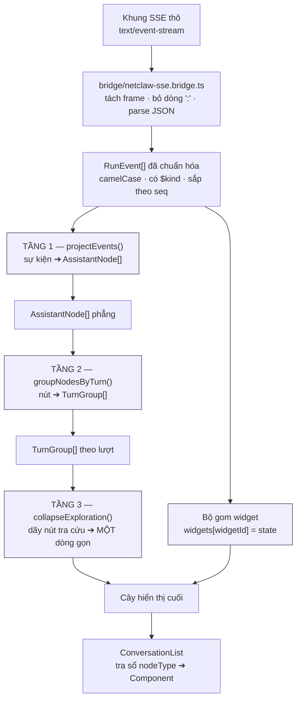
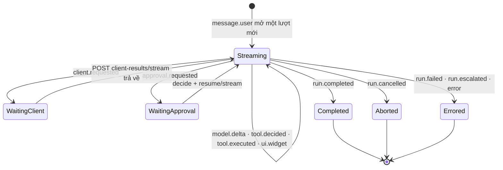

# Plugin Trợ Lý AI Module 02: Sổ Thẻ Hội Thoại & Phép Chiếu Sự Kiện

> **Định dạng tệp**: `specs/plugin-assistant/modules/02-conversation-node-registry.md` (Metadata ID: `FSP-PLUGIN-ASSISTANT-MOD-02`)
> **Loại tài liệu**: `spec-module`
> **Trạng thái**: `draft`
> **Mã Quyết định**: [`QĐ-ASSISTANT-005`](../03-decisions.md) · `006` · `015` · `016`
> **Căn cứ Mã nguồn Tham chiếu**: `.reference/workbench-ide/resources/plugins/workbench.assistant/frontend/src/components/cards/ConversationNodeRegistry.ts#L57-L146` · `utils/build-nodes.ts#L33-L451` · `utils/turn-grouping.ts#L1-L234` · `utils/exploration-ledger.ts#L1-L251`
> **Hợp đồng backend**: [`AGENT_CHAT_API.md §3, §8`](../../../LV_Shell/src/NetClaw/docs/host-lv-shell/AGENT_CHAT_API.md)
> **Đặc tả chung**: [`../05-spec.md`](../05-spec.md) · **Hợp đồng plugin**: [`01-plugin-contract.md`](01-plugin-contract.md)

---

## 1. Bản Chất & Động Lực Kỹ Thuật

### 1.1 Bài toán giải quyết

Một lượt tác tử hiện đại phát ra 20–60 khung SSE cho **một** câu hỏi của người dùng. Chiếu phẳng từng khung thành một dòng giao diện cho ra hai hỏng hóc cùng lúc:

1. **Câu trả lời — thứ duy nhất người dùng thật sự chờ — bị đẩy trôi khỏi tầm mắt** bởi hàng chục chip tra cứu trung gian.
2. **Không chỗ nào kiểm được.** Luật "sự kiện nào ra thẻ nào" nằm rải trong JSX thì chỉ kiểm được bằng cách dựng cả cây React trong một trình duyệt giả — chậm, giòn, và không bao giờ phủ hết ca biên.

Mô-đun này đặt toàn bộ luật hiển thị vào **ba hàm thuần**, kiểm bằng Vitest chạy trên Node, rồi để tầng React chỉ còn việc vẽ.

### 1.2 Vì sao là một SỔ ĐĂNG KÝ chứ không phải một `switch` trong JSX

Ba lý do, lý do thứ ba mới là lý do thật:

1. Một `switch` 16 nhánh trong `ConversationList.tsx` biến tệp đó thành nơi mọi thay đổi nghiệp vụ phải đi qua.
2. Sổ đăng ký cho phép **hai bề mặt nhúng** (ngăn kéo 420px và view toàn màn hình) phân giải cùng một `nodeType` ra cùng một thẻ — không có sổ thì hai bề mặt trôi khỏi nhau sau vài tháng.
3. **Sổ là khe cắm.** Một phân hệ nghiệp vụ mới thêm thẻ trích dẫn riêng bằng `ctx.registerConversationNode('legal:citation', …)` mà không sửa một dòng nào của khung — đúng ca dùng mà [mô-đun 01](01-plugin-contract.md) tồn tại để phục vụ.

### 1.3 Ranh giới phạm vi

* **Trong phạm vi**: từ vựng `$kind` ➔ `nodeType`, sổ 16 thẻ dựng sẵn C1–C16, sổ widget theo `widgetKind`, ba tầng phép chiếu, luật gom lượt, luật nén dãy khám phá, ca biên khi mất kết nối và khi replay.
* **Ngoài phạm vi**: cơ chế đọc luồng SSE và quản lý `runId` (thuộc [`../05-spec.md §5`](../05-spec.md)); hợp đồng `IUiPlugin` và ba khe (thuộc [mô-đun 01](01-plugin-contract.md)); dải dòng nguồn để port từng tệp (thuộc [mô-đun 03](03-workbench-assistant-port-map.md)).

---

## 2. Máy Trạng Thái & Luồng Dữ Liệu

### 2.1 Ba tầng phép chiếu



Bốn khối tô đậm là **0% React, 0% DOM, 0% mạng** — kiểm được bằng Vitest chạy Node. Đây là điều kiện đủ để trả lời câu hỏi *"luật hiển thị kiểm ở đâu"* mà không cần trình duyệt và không cần backend.

### 2.2 Máy trạng thái của một lượt (`TurnGroup`)



**Ranh giới bước lấy thẳng từ `iteration` của sự kiện**, không suy đoán lại từ hình dạng chuỗi nút. Suy đoán lại là dựng một cách đếm bước **thứ hai**, và hai cách đếm sẽ phân kỳ đúng vào ca model gọi nhiều tool song song trong cùng một vòng.

---

## 3. Lược Đồ Dữ Liệu & Hợp Đồng Kỹ Thuật

### 3.1 Sổ 16 thẻ hội thoại dựng sẵn (C1–C16)

> Chốt tại [`QĐ-ASSISTANT-005`](../03-decisions.md). Cột **Nguồn port** chỉ tới tệp trong kho tham chiếu; dải dòng đầy đủ nằm ở [mô-đun 03 §3.2](03-workbench-assistant-port-map.md).

| Mã | `nodeType` | Component | Sự kiện `$kind` sinh ra nó | Ngữ nghĩa nghiệp vụ trên LV_Platform |
|:--:|---|---|---|---|
| **C1** | `user` | `UserBubble` | `message.user` | Tin nhắn người dùng, đính chip ngữ cảnh văn bản đang mở |
| **C2** | `message` | `AssistantBubble` | `model.delta` (text), `model.responded`, `run.completed` | Markdown streaming, nút sao chép, dấu nháy đang gõ |
| **C3** | `thought` | `ThinkingAccordion` | `model.delta` (reasoning) | Luồng suy luận nội tâm, **gập sẵn** |
| **C4** | `approval` | `ToolApprovalCard` | `approval.requested`, `approval.resolved` | Cổng Human-in-the-Loop: tên tool, tham số, hạn `expiresAt`, hai nút Duyệt/Từ chối |
| **C5** | `tool_generic` | `ToolCardGeneric` | `tool.decided`, `tool.executed`, `client.requested` | Chip tool thu gọn: đang gọi ➔ xong ➔ kèm chỉ mục chứng cứ `[n]` |
| **C6** | `tool_terminal` | `ToolCardTerminal` | `tool.executed` có output nhiều dòng | **Đổi ngữ nghĩa**: nhật ký tác vụ nền theo dòng (trích xuất OCR, đồng bộ lô), thay cho terminal của IDE |
| **C7** | `tool_diff` | `ToolCardDiff` | `tool.executed` mang cặp `before`/`after` | **Đổi ngữ nghĩa**: so sánh hai phiên bản **nội dung văn bản nghiệp vụ**, thay cho diff mã nguồn |
| **C8** | `tool_web` | `ToolCardWebSearch` | `tool.executed` của `ai.knowledge.search` | **DANH SÁCH** nguồn tra cứu kèm điểm khớp |
| **C9** | `checklist` | `LiveTaskChecklist` | `ui.widget` với `widgetKind: 'todo-list'` | Checklist kế hoạch nhiều bước kèm tiến độ `done/total` |
| **C10** | `elicitation` | `ElicitationChoiceGate` | `model.responded` mang câu hỏi chọn phương án | Cổng chọn: model hỏi lại, người dùng bấm một lựa chọn |
| **C11** | `compacted` | `ContextCompactedCard` | `context.compacted`, `context.pruned` | Dải mỏng: "đã nén lịch sử để tối ưu", kèm `tokensBefore/After` |
| **C12** | `pills` | `ContextPillCard` | Đính vào C1 từ `PageContext` | Chip ngữ cảnh: phân hệ, mã văn bản, vùng bôi đen |
| **C13** | `progress` | `TurnProgressCard` | `model.queued`, `run.stateChanged` | "Đang chờ tới lượt", "đang chờ Angular thực hiện", trạng thái run |
| **C14** | `tool_web_extract` | `WebCard` | `tool.executed` của `docs.read_attachment` | **MỘT** tài liệu đã bóc tách — khác C8 vốn là một **danh sách** |
| **C15** | `tool_notebook` | `NotebookCellCard` | `tool.executed` thao tác trên một trường | **Đổi ngữ nghĩa**: thao tác trên **một ô/trường biểu mẫu**, thay cho ô notebook |
| **C16** | `collapsed-exploration-ledger` | `CollapsedExplorationLedger` | Một **DÃY** nút C5 tra cứu liền nhau | Thẻ duy nhất nhận cả một dãy: gom `n` lượt tra cứu thành một dòng bung được |

> [!IMPORTANT]
> **Không có thẻ lỗi riêng, và đó là quyết định.** Lỗi là một **trạng thái** của thẻ (`status: 'error'`), không phải một loại thẻ. Lý do: một lỗi luôn luôn thuộc về một cái gì đó — một lượt gọi tool, một lượt chạy — nên tách nó ra thành thẻ độc lập là mất ngữ cảnh "hỏng ở đâu". Thêm nữa, một thẻ thứ 17 tên `ErrorCard` không có nguồn port nào trong kho tham chiếu, trái [`QĐ-ASSISTANT-005`](../03-decisions.md). Lỗi cấp **kết nối/phiên** thì không thuộc hội thoại: nó hiện ở `AssistantBanner` của khung.

### 3.2 Kiểu dữ liệu ba tầng

```typescript
// React_Assistant/src/bridge/flavor-types.ts — hình dạng DÂY, không mang máy móc truyền tải

/** Khung SSE đã tách và giải mã. Quy ước kernel: camelCase, luôn có `$kind`, `seq`. */
export interface RunEvent {
  readonly $kind: string;               // 'message.user' · 'model.delta' · 'ui.widget' …
  readonly eventId: string;             // `${runId}:${seq}`
  readonly seq: number;                 // Tăng dần, không trùng, trong phạm vi một run
  readonly runId: string;
  readonly at: string;                  // ISO-8601
  readonly iteration: number;           // Vòng lặp thứ mấy của ReAct — ranh giới BƯỚC
  readonly actor: { kind: 'user' | 'agent' | 'approver' | 'client' | 'harness' | 'system'; id?: string; name?: string };
  readonly [field: string]: unknown;    // Trường riêng theo từng `$kind`
}
```

```typescript
// React_Assistant/src/store/projection/node-types.ts — TẦNG 1

export type AssistantNodeKind =
  | 'user' | 'message' | 'thought' | 'approval'
  | 'tool_generic' | 'tool_terminal' | 'tool_diff' | 'tool_web' | 'tool_web_extract' | 'tool_notebook'
  | 'checklist' | 'elicitation' | 'compacted' | 'pills' | 'progress'
  | 'collapsed-exploration-ledger';

export type AssistantNodeStatus = 'pending' | 'streaming' | 'ok' | 'error' | 'aborted';

export interface AssistantNode {
  /** Ổn định giữa hai lần dựng — dùng làm `key` của React, KHÔNG dùng chỉ số mảng. */
  readonly id: string;                  // `evt-${seq}` · `live` · `widget-${widgetId}`
  readonly kind: AssistantNodeKind;
  readonly turn: number;                // Lượt thứ mấy trong thread
  readonly step: number;                // = `iteration` của sự kiện nguồn
  readonly seq: number;
  readonly createdAt: number;
  readonly status: AssistantNodeStatus;
  readonly text: string;
  readonly toolName?: string | undefined;
  readonly callId?: string | undefined;
  readonly evidence?: readonly EvidenceRef[] | undefined;
  readonly payload?: unknown | undefined;  // Trạng thái đầy đủ với nút widget
  readonly error?: string | undefined;
  readonly usage?: TurnUsage | undefined;
}

export interface EvidenceRef {
  readonly index: number;               // Số hiện trong ngoặc vuông: [1], [2]
  readonly title: string;
  readonly sourceId?: string;
  readonly snippet?: string;
}

export interface TurnUsage {
  readonly inputTokens: number;
  readonly outputTokens: number;
  readonly cacheReadTokens: number;
  readonly cacheCreateTokens: number;
  readonly durationMs: number;
}
```

```typescript
// React_Assistant/src/store/projection/turn-types.ts — TẦNG 2 & 3

export type TurnStatus = 'streaming' | 'completed' | 'aborted' | 'error';

export interface TurnStep {
  readonly step: number;
  readonly nodes: readonly AssistantNode[];
}

export interface TurnGroup {
  readonly turn: number;
  readonly prompt: string;              // Văn bản của nút C1 mở lượt
  readonly status: TurnStatus;
  readonly steps: readonly TurnStep[];
  readonly answer?: AssistantNode | undefined;   // Nút C2 cuối cùng — thứ người dùng thật sự chờ
  readonly usage?: TurnUsage | undefined;
}

/** TẦNG 3 — một dãy nút tra cứu liền nhau đã nén thành một dòng. */
export interface ExplorationLedger {
  readonly items: readonly { toolName: string; target?: string; query?: string; resultCount?: number }[];
  readonly durationMs: number;
  readonly replacedNodeIds: readonly string[];   // Bung ra là hiện lại đúng các nút này
}
```

### 3.3 Hợp đồng sổ đăng ký

```typescript
// React_Assistant/src/components/cards/ConversationNodeRegistry.ts

export type ConversationCardComponent = React.ComponentType<{ node: AssistantNode; turn: TurnGroup }>;

export interface IConversationNodeRegistry {
  /** Ném nếu `nodeType` rỗng, component rỗng, hoặc tên đã có chủ (Fail-Fast lúc nạp). */
  register(nodeType: string, component: ConversationCardComponent): void;
  /** Im lặng khi không có gì để gỡ — lượt thu hồi thứ hai của cùng một đăng ký không phải lỗi. */
  unregister(nodeType: string): void;
  get(nodeType: string): ConversationCardComponent | undefined;
  has(nodeType: string): boolean;
  getAllNodeTypes(): readonly string[];
}
```

```typescript
// React_Assistant/src/slots/widget-registry.ts

export interface IWidgetRegistry {
  register(widgetKind: string, component: React.ComponentType<IWidgetProps>, ownerId: string): Disposer;
  /** Không tìm thấy ⇒ `undefined`; nơi gọi rơi về bộ dựng JSON thu gọn. */
  get(widgetKind: string): React.ComponentType<IWidgetProps> | undefined;
}
```

---

## 4. Thuật Toán & Quy Tắc Xử Lý Chi Tiết

### 4.1 Bất biến bất khả xâm phạm

1. **`[INV-NODE-01]` Log sự kiện là nguồn sự thật duy nhất.** Không có mảng `messages[]` song song. Thứ duy nhất không tới từ sự kiện là **bản xem trước của lượt chưa đóng** — nó phù du, không ghi đâu cả, và luôn bị sự kiện thật thay chỗ ngay khi sự kiện đó về.
2. **`[INV-NODE-02]` Phép chiếu là hàm thuần và tất định.** Cùng một mảng `RunEvent[]` luôn cho ra cùng một `AssistantNode[]`. Không đọc đồng hồ, không đọc `Math.random()`, không đọc store.
3. **`[INV-NODE-03]` Không sắp xếp lại.** Duyệt **một lượt** theo đúng thứ tự `seq`. `seq` là thứ tự của sự thật; sắp lại theo `at` là đưa vào một nguồn thứ hai có thể lệch đồng hồ.
4. **`[INV-NODE-04]` `$kind` lạ không được gây lỗi.** Không sinh nút, ghi cảnh báo cấp `debug`, đi tiếp — [`QĐ-ASSISTANT-016`](../03-decisions.md).
5. **`[INV-NODE-05]` Không suy đoán ý định từ văn xuôi model.** Hành vi chỉ được kích hoạt bởi sự kiện có cấu trúc. Dò chuỗi trong câu trả lời là hành vi vỡ ngay khi đổi model.
6. **`[INV-NODE-06]` `id` nút ổn định giữa hai lần dựng.** Dùng `evt-${seq}`, không dùng chỉ số mảng — chỉ số đổi mỗi khi một nút chèn vào giữa, và React sẽ dựng lại toàn bộ đuôi danh sách.

### 4.2 TẦNG 1 — `projectEvents()`: sự kiện ➔ nút

**Chữ ký**

```typescript
export function projectEvents(
  events: readonly RunEvent[],
  liveDelta?: { text: string; turn: number; step: number } | null,
): AssistantNode[];
```

**Trạng thái phụ trợ duy nhất trong vòng duyệt**: `toolIndexByCallId: Map<string, number>` — chỉ số nút tool đã mở, để `tool.executed` gộp vào đúng thẻ mà `tool.decided` đã tạo, thay vì đẻ ra thẻ thứ hai.

**Bảng xử lý từng `$kind`** — đây là toàn bộ luật, không có nhánh nào nằm ngoài bảng:

| `$kind` | Phép biến đổi | Nút sinh ra |
|---|---|---|
| `message.user` | `source === 'harness'` ⇒ bỏ qua (lời nhắc nội bộ của bộ kiểm chứng, không phải lời người dùng) | `kind: 'user'`, `status: 'ok'`, `text` |
| `model.delta` | Trường `textDelta` ⇒ nối vào nút `message` đang mở của cùng `(turn, step)`; chưa có thì tạo với `status: 'streaming'` | `kind: 'message'` |
| `model.delta` (reasoning) | Trường `reasoningDelta` ⇒ nối vào nút `thought` đang mở | `kind: 'thought'`, gập sẵn |
| `model.responded` | Đóng nút `message` đang mở: `status: 'ok'`, thay `text` bằng `message.text` cuối. `toolCalls` rỗng ⇒ đây là câu trả lời của lượt | `kind: 'message'` |
| `model.queued` | Nút phù du. **Xóa ngay khi thấy `model.delta` hoặc `model.responded`** — không có frame "hết chờ" riêng | `kind: 'progress'`, `status: 'pending'` |
| `model.failed` | Đóng nút `message` đang mở với `status: 'error'`, `error` = thông điệp | `kind: 'message'` |
| `tool.decided` | Mở một nút tool, ghi `callId` vào `toolIndexByCallId`. `decision` là từ chối ⇒ `status: 'error'` ngay | `kind` theo §4.4, `status: 'pending'` |
| `tool.executed` | Tra `callId`: **có** ⇒ cập nhật tại chỗ (`status` theo `isError`, nạp `content` + `evidence`); **không** ⇒ mở nút mới đã hoàn tất | cập nhật hoặc tạo |
| `client.requested` | Mở nút tool với `status: 'pending'` và nhãn "đang chờ màn hình thực hiện". Kết quả về bằng `tool.executed` cùng `callId` với `actor.kind === 'client'` | `kind: 'tool_generic'` |
| `approval.requested` | Mở nút duyệt mang `approvalId`, `riskClass`, `argumentsJson` | `kind: 'approval'`, `status: 'pending'` |
| `approval.resolved` | Tra theo `approvalId`, đóng nút: `outcome` là duyệt ⇒ `ok`, từ chối ⇒ `aborted`. `bindingValid === false` ⇒ `error` kèm "tham số đã đổi sau khi duyệt" | cập nhật |
| `context.compacted` · `context.pruned` | Một nút dải mỏng | `kind: 'compacted'`, `status: 'ok'` |
| `ui.widget` | **Không đi qua tầng này.** Xử lý riêng ở §4.3 | — |
| `run.stateChanged` | Chỉ cập nhật trạng thái run của store; sinh nút `progress` **chỉ khi** `to` là `WaitingClient` / `WaitingApproval` | `kind: 'progress'` (có điều kiện) |
| `run.completed` | Đóng lượt: gắn `usage` và `iterations` vào lượt. `finalText` **không** sinh nút mới — nó trùng nội dung nút `message` cuối | cập nhật lượt |
| `run.cancelled` | Đóng lượt `aborted`; mọi nút `pending` còn lại chuyển `aborted` | cập nhật |
| `run.failed` · `run.escalated` | Đóng lượt `error`; mọi nút `pending` còn lại chuyển `error` | cập nhật |
| `error` | Đóng lượt `error`, `text` = `description`, giữ `code` để hiện mã lỗi | cập nhật |
| `run` | Frame cuối, DTO **PascalCase**. Không sinh nút; dùng để đối chiếu `State` và `FinalText` | — |
| *(khác)* | `debug` một dòng, không sinh nút | — |

**Bản xem trước của lượt chưa đóng (`liveDelta`).** Khi đang stream mà chưa có `model.responded`, hàm chèn một nút `id: 'live'`, `status: 'streaming'`. Nút này **luôn đứng cuối** và bị thay chỗ ngay khi sự kiện thật về. Nó không bao giờ được ghi vào bất kỳ kho nào — replay không bao giờ dựng lại nó.

### 4.3 Bộ gom widget — `ui.widget`

> Chốt tại [`QĐ-ASSISTANT-006`](../03-decisions.md). Hình dạng lấy nguyên từ [`AGENT_CHAT_API.md §8.1`](../../../LV_Shell/src/NetClaw/docs/host-lv-shell/AGENT_CHAT_API.md).

```typescript
export function reduceWidgets(
  current: ReadonlyMap<string, WidgetEntry>,
  event: RunEvent,
): ReadonlyMap<string, WidgetEntry>;
```

1. **`op: 'upsert'`** ⇒ `widgets[widgetId] = { widgetKind, title, state, source, callId, seq }`. Thay **toàn bộ**, không hợp nhất sâu: backend luôn gửi trạng thái đầy đủ, nên hợp nhất sâu chỉ tạo cơ hội cho một trường cũ sống sót sai.
2. **`op: 'remove'`** ⇒ xóa khóa `widgetId`.
3. **Vị trí hiển thị**: widget xen vào dòng hội thoại tại vị trí `seq` của **lần upsert đầu tiên** của `widgetId` đó. Các lần upsert sau chỉ đổi nội dung, **không** nhảy widget xuống cuối — một checklist nhảy chỗ mỗi lần tích một ô là giao diện không đọc được.
4. **Tra bộ render**: `widgetRegistry.get(widgetKind)`.
   * Tìm thấy ⇒ render component, truyền `IWidgetProps`.
   * **Không** tìm thấy ⇒ render JSON thu gọn, gập sẵn, kèm nhãn `widgetKind`. Không ném.
5. **`callId` có giá trị** ⇒ widget được gom vào cùng thẻ với nút tool mang `callId` đó, thay vì đứng rời.
6. **Replay dựng lại đúng**: vì mỗi `upsert` là trạng thái đầy đủ, chạy lại toàn bộ `GET runs/{id}/events` cho ra đúng bản đồ widget cuối cùng. Không cần lưu riêng.

### 4.4 Chọn `nodeType` cho một nút tool

Tra theo thứ tự, dừng ở luật đầu tiên khớp:

| Thứ tự | Điều kiện | `nodeType` | Mã thẻ |
|:--:|---|---|:--:|
| 1 | `toolName === 'ai.knowledge.search'` | `tool_web` | C8 |
| 2 | `toolName === 'docs.read_attachment'` | `tool_web_extract` | C14 |
| 3 | `result` mang cả `before` và `after` | `tool_diff` | C7 |
| 4 | `result.content` có ≥ 8 dòng và không phải JSON | `tool_terminal` | C6 |
| 5 | `result` mang `fieldPath` (thao tác một trường biểu mẫu) | `tool_notebook` | C15 |
| 6 | Mặc định | `tool_generic` | C5 |

Luật 4 dùng ngưỡng **8 dòng**, không phải một phép đoán "trông giống terminal": ngưỡng là một con số kiểm được, còn phép đoán thì không.

### 4.5 TẦNG 2 — `groupNodesByTurn()`: nút ➔ lượt

Duyệt một lượt theo thứ tự `seq`:

1. Gặp nút `kind: 'user'` ⇒ **đóng** lượt đang mở (nếu có) và **mở** lượt mới, `prompt` = `text` của nút đó.
2. Mọi nút sau đó rơi vào `steps` của lượt hiện hành, gom theo `node.step` (`= iteration`).
3. `answer` = nút `message` **cuối cùng** có `status: 'ok'` trong lượt. Đây là thứ giao diện phải giữ luôn hiện; mọi thứ khác gập được.
4. `status` của lượt: có nút `error` ⇒ `error`; có nút `aborted` ⇒ `aborted`; đã thấy `run.completed` ⇒ `completed`; còn lại ⇒ `streaming`.
5. Nút đến **trước** nút `user` đầu tiên (ví dụ `context.compacted` của một thread nạp lại) rơi vào một lượt ẩn danh `turn: 0`, hiện trên đầu danh sách.

### 4.6 TẦNG 3 — `collapseExploration()`: nén dãy khám phá

Phép gộp **không** sống trong hàm chọn `nodeType`: hàm đó nhìn đúng một nút và trả về đúng một tên thẻ, nên nó không bao giờ thấy được "ba lượt tra cứu đứng liền nhau". **Tính liền kề là thuộc tính của một DÃY**, và nó chỉ tồn tại ở nơi cầm cả dãy.

1. Quét trong từng `TurnStep`, tìm **dãy liên tiếp** các nút có `kind` thuộc `{tool_generic, tool_web, tool_web_extract}` và `status: 'ok'`.
2. Dãy dài **≥ 3** ⇒ thay bằng một nút `collapsed-exploration-ledger` mang `ExplorationLedger`, trong đó `replacedNodeIds` giữ nguyên `id` của các nút bị thay.
3. Dãy dài **< 3** ⇒ giữ nguyên, không nén. Nén hai nút thành một dòng bung được là thêm một cú bấm mà không tiết kiệm được gì.
4. Người dùng bung ⇒ hiện lại đúng các nút trong `replacedNodeIds`, không dựng lại từ sự kiện.
5. **Không nén** nút có `status` khác `ok`: một lượt tra cứu hỏng là thứ người dùng cần nhìn thấy ngay, không phải thứ cần gói lại.

### 4.7 Ma trận ca biên

| Ca biên | Tình huống kích hoạt | Hành vi bắt buộc | Kết quả |
|---|---|---|---|
| `$kind` chưa biết | Backend thêm loại sự kiện mới | Không sinh nút, `debug` một dòng, đi tiếp | Giao diện cũ vẫn chạy trên backend mới |
| `tool.executed` không có `tool.decided` trước | Replay bắt đầu giữa chừng, hoặc tool phía client | Mở nút mới đã hoàn tất | Không mất thẻ |
| Hai `tool.executed` cùng `callId` | Backend phát lặp | Lần sau ghi đè lần trước | Không đẻ thẻ trùng |
| `approval.resolved` không khớp `approvalId` nào | Thẻ duyệt đã trôi khỏi cửa sổ replay | Bỏ qua, `debug` một dòng | Không ném |
| `bindingValid === false` | Tham số đổi sau khi duyệt | Nút duyệt ⇒ `status: 'error'`, nêu rõ "tham số đã đổi" | Người dùng hiểu vì sao bị chặn |
| Mất kết nối giữa luồng | Mạng rớt, proxy cắt | `GET runs/{runId}` lấy `state`, rồi `GET runs/{runId}/events?after={seq cuối}`, chiếu lại | Không mất nút nào; `model.queued` không quay lại và **đúng như vậy** |
| Dòng bắt đầu bằng `:` | Nhịp tim mỗi 15 giây im lặng | Bộ đọc bỏ qua trước khi tới tầng chiếu | Không sinh nút rác |
| `ui.widget` với `widgetKind` lạ | Backend thêm loại widget | JSON thu gọn gập sẵn | Không ném, không trống chỗ |
| `model.delta` tới sau `model.responded` cùng bước | Sự kiện tới lệch thứ tự | Bỏ qua — nút đã đóng | Không "mọc đuôi" sau câu trả lời |
| Lượt chưa đóng khi đóng ngăn kéo | Người dùng đóng Trợ lý | Nút `live` biến mất; run vẫn chạy ở server | Mở lại ➔ replay dựng đủ |
| `evidence[]` rỗng nhưng `content` có `[1]` | Model tự bịa chỉ mục | Hiện `[1]` ở dạng chữ thường, **không** biến thành liên kết | Không có liên kết chết |

---

## 5. Dữ Liệu Mẫu & Kịch Bản Điển Hình

### 5.1 Chuỗi sự kiện của một lượt thành công

```json
[
  {"$kind":"message.user","eventId":"run-99:1","seq":1,"runId":"run-99","iteration":0,"at":"2026-09-21T08:00:00Z",
   "actor":{"kind":"user","id":"u-7"},"text":"Lập hồ sơ trình ký văn bản này","source":"user"},

  {"$kind":"tool.decided","eventId":"run-99:2","seq":2,"runId":"run-99","iteration":1,"at":"2026-09-21T08:00:01Z",
   "actor":{"kind":"harness"},"callId":"call_1","toolName":"ai.knowledge.search","decision":"allow"},

  {"$kind":"tool.executed","eventId":"run-99:3","seq":3,"runId":"run-99","iteration":1,"at":"2026-09-21T08:00:03Z",
   "actor":{"kind":"agent","id":"tro-ly-ca-nhan"},
   "result":{"callId":"call_1","toolName":"ai.knowledge.search","isError":false,
             "content":"Tìm thấy 2 quy chế liên quan",
             "evidence":[{"index":1,"title":"QC-2024/TRINH-KY"},{"index":2,"title":"HD-2025/KY-SO"}]}},

  {"$kind":"ui.widget","eventId":"run-99:4","seq":4,"runId":"run-99","iteration":1,"at":"2026-09-21T08:00:04Z",
   "actor":{"kind":"agent"},"widgetId":"plan","widgetKind":"todo-list","op":"upsert","title":"Lập hồ sơ trình ký",
   "state":{"items":[{"id":"s1","title":"Mở màn hình trình ký","status":"in_progress"},
                     {"id":"s2","title":"Điền trích yếu và người ký","status":"pending"}],"done":0,"total":2},
   "source":"plan.write","callId":"call_2"},

  {"$kind":"client.requested","eventId":"run-99:5","seq":5,"runId":"run-99","iteration":2,"at":"2026-09-21T08:00:05Z",
   "actor":{"kind":"agent"},"callId":"call_3","toolName":"ui.navigate",
   "argumentsJson":"{\"route\":\"/tks/create?sourceDocId=DOC-2026-99\"}"},

  {"$kind":"tool.executed","eventId":"run-99:6","seq":6,"runId":"run-99","iteration":2,"at":"2026-09-21T08:00:07Z",
   "actor":{"kind":"client"},
   "result":{"callId":"call_3","toolName":"ui.navigate","isError":false,"content":"Đã mở màn hình trình ký"}},

  {"$kind":"model.delta","eventId":"run-99:7","seq":7,"runId":"run-99","iteration":3,"at":"2026-09-21T08:00:08Z",
   "actor":{"kind":"agent"},"textDelta":"Em đã mở màn hình trình ký "},

  {"$kind":"model.responded","eventId":"run-99:8","seq":8,"runId":"run-99","iteration":3,"at":"2026-09-21T08:00:09Z",
   "actor":{"kind":"agent"},
   "message":{"text":"Em đã mở màn hình trình ký và điền sẵn trích yếu. Anh/chị kiểm tra rồi bấm Lưu giúp em ạ.","toolCalls":[]},
   "usage":{"inputTokens":4210,"outputTokens":118,"cacheReadTokens":3800,"cacheCreateTokens":0},
   "finishReason":"stop"},

  {"$kind":"run.completed","eventId":"run-99:9","seq":9,"runId":"run-99","iteration":3,"at":"2026-09-21T08:00:09Z",
   "actor":{"kind":"harness"},"finalText":"Em đã mở màn hình trình ký…","iterations":3}
]
```

### 5.2 Kết quả sau ba tầng chiếu

```json
{
  "turns": [
    {
      "turn": 1,
      "prompt": "Lập hồ sơ trình ký văn bản này",
      "status": "completed",
      "steps": [
        { "step": 1, "nodes": [
            { "id": "evt-2", "kind": "tool_web", "status": "ok", "toolName": "ai.knowledge.search",
              "callId": "call_1", "text": "Tìm thấy 2 quy chế liên quan",
              "evidence": [{"index":1,"title":"QC-2024/TRINH-KY"},{"index":2,"title":"HD-2025/KY-SO"}] }
        ]},
        { "step": 2, "nodes": [
            { "id": "evt-5", "kind": "tool_generic", "status": "ok", "toolName": "ui.navigate",
              "callId": "call_3", "text": "Đã mở màn hình trình ký" }
        ]},
        { "step": 3, "nodes": [
            { "id": "evt-7", "kind": "message", "status": "ok",
              "text": "Em đã mở màn hình trình ký và điền sẵn trích yếu. Anh/chị kiểm tra rồi bấm Lưu giúp em ạ." }
        ]}
      ],
      "answer": { "id": "evt-7", "kind": "message", "status": "ok" },
      "usage": { "inputTokens": 4210, "outputTokens": 118, "cacheReadTokens": 3800, "cacheCreateTokens": 0 }
    }
  ],
  "widgets": {
    "plan": { "widgetKind": "todo-list", "title": "Lập hồ sơ trình ký", "anchorSeq": 4,
              "state": { "items": [ { "id":"s1","title":"Mở màn hình trình ký","status":"in_progress" },
                                    { "id":"s2","title":"Điền trích yếu và người ký","status":"pending" } ],
                         "done": 0, "total": 2 } }
  }
}
```

Dãy tra cứu chỉ có **một** nút nên tầng 3 không nén — đúng luật §4.6 mục 3.

### 5.3 Luồng thất bại — tool bị từ chối lúc thực thi

```json
[
  {"$kind":"client.requested","seq":11,"iteration":4,"callId":"call_9","toolName":"ui.navigate",
   "argumentsJson":"{\"route\":\"/admin/users/delete-all\"}","actor":{"kind":"agent"}},

  {"$kind":"tool.executed","seq":12,"iteration":4,"actor":{"kind":"client"},
   "result":{"callId":"call_9","toolName":"ui.navigate","isError":true,
             "content":"Từ chối: route '/admin/users/delete-all' không nằm trong danh mục hành động hợp lệ của màn hình hiện tại."}},

  {"$kind":"model.responded","seq":13,"iteration":5,"actor":{"kind":"agent"},
   "message":{"text":"Em không mở được màn hình đó vì nó không nằm trong danh mục em được phép thao tác. Anh/chị thao tác trực tiếp giúp em ạ.","toolCalls":[]}}
]
```

Nút `evt-11` nhận `status: 'error'`, hiện nguyên văn lý do từ chối. Đây là hình dạng đúng của [`[INV-ASSISTANT-02]`](../README.md): model **đề xuất được** một route không tồn tại; cái bị chặn là **việc thực thi**, và lý do từ chối quay ngược lên thành câu trả lời cho người dùng.

---

## 6. Ranh Giới Tích Hợp

| Ranh giới | Tệp | Hợp đồng |
|---|---|---|
| Luồng SSE ➔ tầng chiếu | `src/bridge/netclaw-sse.bridge.ts` | Trả `RunEvent[]` đã bỏ dòng `:`, đã parse, đã sắp theo `seq`. **Không** chiếu, **không** biết thẻ nào tồn tại |
| Tầng chiếu ➔ store | `src/store/assistant.store.ts` | Store giữ **ảnh chụp phẳng**: `events`, `nodes`, `turns`, `widgets`. Không chứa thuật toán — thuật toán nằm ở `store/projection/` |
| Store ➔ giao diện | `src/views/chat/ConversationList.tsx` | Đọc `turns` + `widgets`, tra sổ `nodeType`, bọc mỗi thẻ trong `CardBoundary` |
| Sổ thẻ ➔ plugin | `ctx.registerConversationNode()` | Tra **dựng sẵn trước, đóng góp sau**: một plugin không bao giờ đè được 16 thẻ lõi |
| Sổ widget ➔ plugin | `IUiPlugin.widgets` | Tra theo `widgetKind`; tên không tiền tố thuộc backend lõi — [mô-đun 01 §4.4](01-plugin-contract.md) |
| Replay ➔ tầng chiếu | `GET runs/{id}/events?after=` | Trả bản bọc PascalCase; lấy `Payload` rồi đưa vào **cùng một** `projectEvents()`. Một hàm chiếu, hai đường vào |

> [!NOTE]
> **Một hàm chiếu cho cả hai đường vào là bất biến, không phải tiện ích.** SSE và replay mà đi qua hai đường xử lý khác nhau thì sớm muộn sẽ dựng ra hai giao diện khác nhau cho cùng một lượt chạy — và sai lệch ấy chỉ lộ ra sau khi người dùng bấm F5, tức đúng lúc khó tái hiện nhất.
