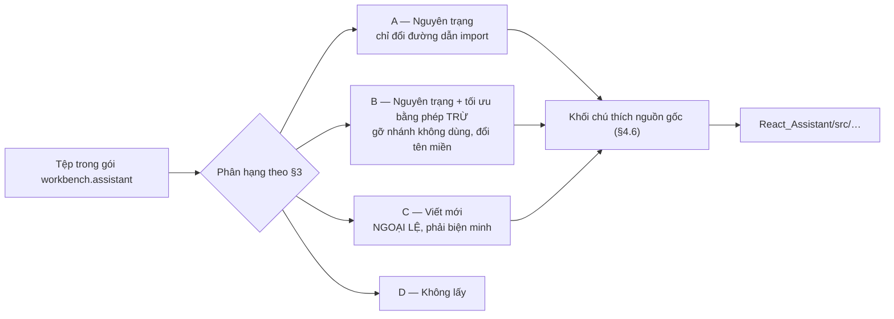
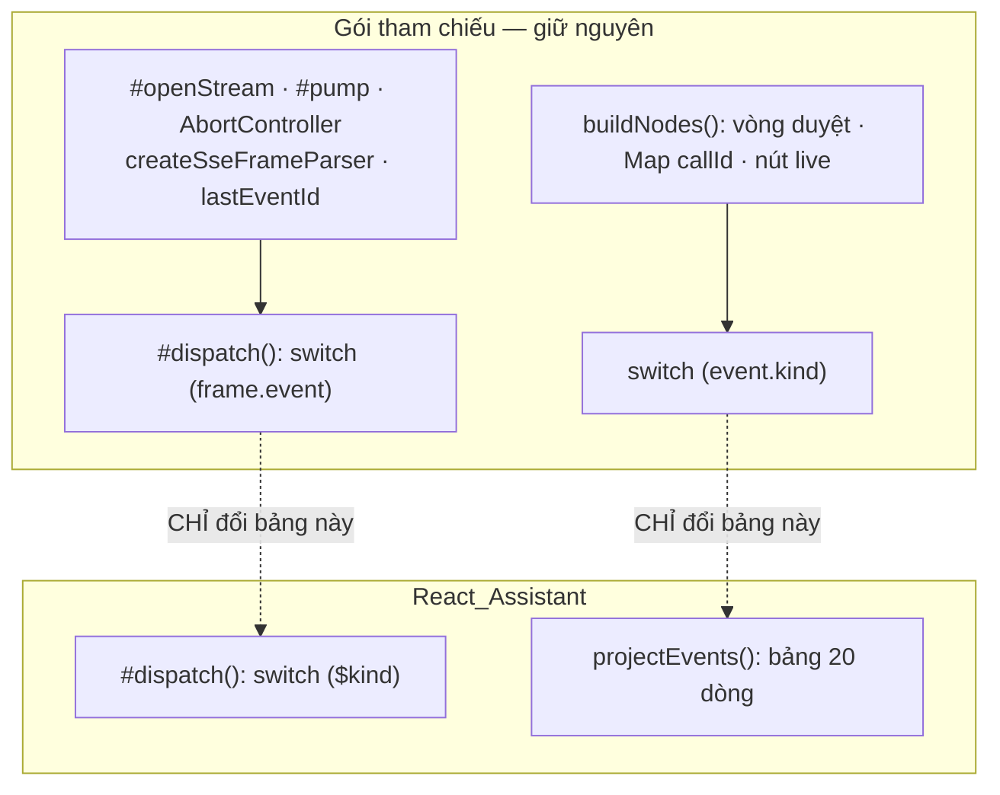

# Plugin Trợ Lý AI Module 03: Bản Đồ Port Gói `workbench.assistant`

> **Định dạng tệp**: `specs/plugin-assistant/modules/03-workbench-assistant-port-map.md` (Metadata ID: `FSP-PLUGIN-ASSISTANT-MOD-03`)
> **Loại tài liệu**: `spec-module`
> **Trạng thái**: `draft`
> **Mã Quyết định**: [`QĐ-ASSISTANT-014`](../03-decisions.md) · `001` · `005` · `013` · `015`
> **Kho tham chiếu**: `.reference/workbench-ide/resources/plugins/workbench.assistant/frontend/` — cách lấy về tại §1.3
> **Bản đồ kế thừa của VỎ** (không chồng lấn tài liệu này): [`multi-flavor/modules/03`](../../multi-flavor-architecture/modules/03-workbench-inheritance-map.md)
> **Hợp đồng plugin**: [`01-plugin-contract.md`](01-plugin-contract.md) · **Sổ thẻ**: [`02-conversation-node-registry.md`](02-conversation-node-registry.md)

---

## 1. Bản Chất & Động Lực Kỹ Thuật

### 1.1 Bài toán giải quyết

Phần nghiệp vụ Trợ lý phải dựng từ đầu: phép chiếu sự kiện thành thẻ, phép gom lượt, phép nén dãy khám phá, 16 thẻ hội thoại, ô soạn thảo hai tầng có gợi ý `/` và `@`, bộ đọc luồng có tự bám lại, hàng đợi phê duyệt, bộ dựng Markdown an toàn cho văn bản model sinh, neo cuộn khi đang stream.

Toàn bộ những thứ đó **đã tồn tại và đã chạy thật** trong gói `workbench.assistant`: **116 tệp mã (~29.500 dòng)** và **58 tệp kiểm**. Viết lại từ đầu là trả lại một lần nữa cái giá đã trả — và trả bằng chất lượng thấp hơn, vì bản mới chưa đi qua những ca biên mà bản cũ đã vấp.

### 1.2 Phân biệt với bản đồ kế thừa của VỎ

Hai tài liệu, hai kho nguồn, không chồng lấn một dòng nào:

| | [`multi-flavor/modules/03`](../../multi-flavor-architecture/modules/03-workbench-inheritance-map.md) | **Tài liệu này** |
|---|---|---|
| Kho nguồn | `.reference/workbench-ide/apps/react/src/` | `.reference/workbench-ide/resources/plugins/workbench.assistant/frontend/src/` |
| Nội dung | Vỏ: SDK 16 nhóm linh kiện, sổ overlay, bẫy focus, khung màn hình 10 Parts | Nghiệp vụ: phép chiếu sự kiện, thẻ hội thoại, ô soạn, luồng phê duyệt |
| Đích | `React_Assistant/src/sdk/`, `src/harness/` | `React_Assistant/src/store/projection/`, `src/components/`, `src/views/chat/`, `src/plugins/assistant/` |
| Câu hỏi nó trả lời | *Lấy đâu ra một `Modal` chạy được trong Shadow Root?* | *Lấy đâu ra luật "sự kiện nào ra thẻ nào"?* |

Đọc tài liệu kia trước khi đọc tài liệu này: linh kiện nền phải có mặt thì thẻ hội thoại mới dựng được.

### 1.3 Kho tham chiếu & luật "port, không phụ thuộc"

Kho đã có sẵn tại `.reference/workbench-ide/`; mọi trích dẫn trong tài liệu này tính từ gốc đó. Máy nào chưa có:

```bash
git clone --depth 1 --single-branch <url-nội-bộ-của-WorkbenchIDE> .reference/workbench-ide
```

`.reference/.gitignore` đã loại trừ toàn bộ thư mục con nên bản sao không bao giờ lọt vào lịch sử Git của `LV_Platform`. Bắt buộc tuân thủ `[INV-REF-READONLY]`: **không sửa, không format, không commit** bất cứ thứ gì bên trong.

> **Luật port — bất biến của mô-đun này.** Tệp cần dùng thì **chép một bản về thành tài nguyên của chính `React_Assistant/`**, kèm khối chú thích nguồn gốc (§4.6). Tuyệt đối **không**:
> - khai `workbench-ide` làm dependency trong `package.json`;
> - trỏ path alias hay `tsconfig.paths` vào `.reference/`;
> - `import` xuyên ranh giới repo bằng đường dẫn tương đối kiểu `../../.reference/…`.
>
> Ba điều cấm trên có chung một lý do: `.reference/` là **bằng chứng, không phải mã thi công**. Nó bị `.gitignore` loại trừ, không có trên máy build, và có thể bị xóa bất cứ lúc nào khi đợt nghiên cứu kết thúc. Một `import` trỏ vào đó là một bản build xanh trên máy người viết và đỏ trên CI.

> Không có kho tham chiếu thì **vẫn thi công được**: toàn bộ hợp đồng, thuật toán và luật cần thiết nằm ở [mô-đun 01](01-plugin-contract.md) và [mô-đun 02](02-conversation-node-registry.md). Kho chỉ cần khi muốn đọc chi tiết cài đặt của một thuật toán để chép tinh thần của nó.

### 1.4 Ranh giới phạm vi

* **Trong phạm vi**: phân hạng A/B/C/D từng tệp nguồn, đường dẫn đích trong `React_Assistant/`, điểm phải chỉnh khi port, thứ tự port, ngân sách, luật ghi nguồn gốc.
* **Ngoài phạm vi**: hợp đồng `IUiPlugin` (mô-đun 01); ma trận sự kiện ➔ thẻ (mô-đun 02); linh kiện SDK nền ([`multi-flavor/modules/03`](../../multi-flavor-architecture/modules/03-workbench-inheritance-map.md)); token giao diện ([`multi-flavor/modules/02`](../../multi-flavor-architecture/modules/02-ui-token-contract.md)).

---

## 2. Máy Trạng Thái & Luồng Dữ Liệu

### 2.1 Bốn hạng port



### 2.2 Hạng B là phép TRỪ, không phải phép viết lại

> Chốt tại [`QĐ-ASSISTANT-017`](../03-decisions.md).

`workbench-ide` **tự nó đã là một bản port đã tối ưu** từ nhiều nguồn công nghiệp (VS Code, Angular CDK, DeepSeek Harness, Toolcode). Mã trong đó đã đi qua ca biên thật và có bài kiểm đi kèm. Vì vậy hạng B **không** có nghĩa là "đọc để hiểu rồi gõ lại theo ý mình", mà là ba thao tác có thể liệt kê hết:

| Thao tác của hạng B | Ví dụ cụ thể trong bảng §3 |
|---|---|
| **Trừ** — gỡ nhánh, prop, import không dùng | `AssistantComposer` gỡ bộ chọn model, bộ chọn chế độ duyệt, bảng chọn đường dẫn, nút micro, chip ảnh |
| **Đổi tên miền** — giữ nguyên cấu trúc, đổi từ vựng | `#dispatch()` của cầu nối SSE đổi `switch (frame.event)` từ `turn_start`/`delta`/`tool_call` sang `$kind` của NetClaw |
| **Nối lại điểm biên** — đổi đầu vào/đầu ra, không đổi thân | `ToolApprovalCard` đổi hai lời gọi sang `decide` + `resume/stream` qua facade của `bridge/` |

Phép **cộng** — thêm một nhánh, thêm một ca biên — cũng thuộc hạng B. Thứ duy nhất không được làm là **gõ lại từ trang trắng một tệp đã có**.

### 2.3 Ba điều kiện của một ngoại lệ hạng C

Một tệp chỉ được xếp hạng C khi hội đủ **cả ba**, và lý do phải ghi thẳng vào cột Ghi chú:

1. **Không có tệp nguồn tương ứng** — thứ cần dựng chưa từng tồn tại ở gói tham chiếu (ví dụ `plugins/registry.ts`, vì gói tham chiếu nạp plugin lúc chạy chứ không liệt kê tĩnh).
2. **Hoặc** tệp nguồn dựng quanh một trụ cột hạ tầng mà Guest **không có và sẽ không bao giờ có** (Monaco, xterm, JSON-RPC xuống tiến trình .NET cục bộ, hệ tệp).
3. **Phép trừ không cứu được** — sau khi gỡ hết nhánh không dùng thì phần còn lại nhỏ hơn phần đã gỡ, tức tệp đó vốn là vỏ của chính thứ ta bỏ.

> [!CAUTION]
> **Bài học đắt nhất của chính đợt rà soát này.** `bridge/assistant-sse.bridge.ts` từng bị xếp hạng C vì dài 1.388 dòng và "nói JSON-RPC". Đọc kỹ thì nó chứa `createSseFrameParser()` — một bộ tách khung `text/event-stream` **chuẩn W3C** xử lý đúng ca **CR đứng cuối bộ đệm** khi nửa sau của cặp CRLF nằm ở chunk kế tiếp, cộng `id:` / `retry:` / `Last-Event-ID` và phép bỏ dòng nhịp tim. Một bản tự viết bằng phép tìm dấu ngắt khung thô sơ hỏng **im lặng** ở đúng ca đó và chỉ lộ ra dưới tải thật.
>
> **Độ dài của một tệp không phải căn cứ phân hạng.** Căn cứ duy nhất là ba điều kiện ở trên.
>
> Căn cứ Mã nguồn: `.reference/workbench-ide/resources/plugins/workbench.assistant/frontend/src/bridge/assistant-sse.bridge.ts#L80-L169`

### 2.4 Chỗ duy nhất buộc phải đổi nhiều: từ vựng sự kiện

Gói tham chiếu nói chuyện với backend .NET của chính nó bằng từ vựng `user/message`, `turn/start`, `assistant/thought`, `tool/call`, `tool/result`. Trợ lý LV_Platform nói chuyện với `LV.NetClaw` bằng `$kind`: `message.user`, `model.delta`, `model.responded`, `tool.decided`, `tool.executed`, `client.requested`, `approval.requested`, `ui.widget`.

> Căn cứ Mã nguồn: `.reference/workbench-ide/resources/plugins/workbench.assistant/frontend/src/utils/build-nodes.ts#L33-L42`

Khác biệt này **chỉ chạm vào hai bảng `switch`** — `#dispatch()` của cầu nối và `projectEvents()` của tầng chiếu. Mọi thứ bao quanh hai bảng đó giữ nguyên. Và cả hai bảng mới **đã được viết sẵn** tại [mô-đun 02 §4.2](02-conversation-node-registry.md), nên lượt port chỉ còn là chép bảng mới vào chỗ bảng cũ.



---


## 3. Lược Đồ Dữ Liệu & Hợp Đồng Kỹ Thuật — Danh Mục Port Theo Tệp

Mọi đường dẫn ở cột **Nguồn** tính từ gốc chung:

```
.reference/workbench-ide/resources/plugins/workbench.assistant/frontend/
```

Mọi đường dẫn ở cột **Đích** tính từ `React_Assistant/src/`.

### 3.1 Tầng chiếu headless — giá trị cao nhất, rủi ro thấp nhất

TypeScript thuần, 0% React, 0% DOM, **mỗi tệp có bài kiểm đi kèm**. Đây là phần "tinh hoa" đúng nghĩa.

| Hạng | Đích | Nguồn (`#L<đầu>-L<cuối>`) | Điểm phải chỉnh · Vì sao cần |
|:--:|---|---|---|
| **B** | `store/projection/project-events.ts` | `src/utils/build-nodes.ts#L1-L451` | **Đổi bảng `switch`** sang 20 dòng của [mô-đun 02 §4.2](02-conversation-node-registry.md). **Giữ nguyên**: hình dạng `AssistantNode`, `Map<callId, index>` gộp `tool.executed` vào thẻ đã mở (`#L243-L244`), nút `live` phù du, `id = evt-${seq}` ổn định |
| **B** | `store/projection/group-turns.ts` | `src/utils/turn-grouping.ts#L1-L234` | Đổi nguồn ranh giới bước từ `node.step` của SQLite sang `iteration` của `RunEvent`. Giữ nguyên thuật toán một lượt duyệt, không sắp lại |
| **B** | `store/projection/collapse-exploration.ts` | `src/utils/exploration-ledger.ts#L1-L251` | Đổi danh mục tool được nén sang `{ai.knowledge.search, docs.read_attachment, core.directory.search_person}`; giữ ngưỡng dãy ≥ 3 và cơ chế `replacedNodeIds` |
| **A** | `store/projection/turn-usage.ts` | `src/utils/turn-usage.ts#L1-L173` | Cộng dồn token theo lượt. Tên trường `inputTokens`/`outputTokens`/`cacheReadTokens` trùng khít `usage` của NetClaw |
| **A** | `sdk/headless/scroll-anchor.ts` | `src/utils/scroll-anchor.ts#L1-L70` | Số học thuần trên ba số đo phần tử cuộn. Kiểm được trên Node, trong khi chính vùng cuộn thì không — jsdom trả `scrollHeight`/`clientHeight` bằng 0 cho mọi phần tử |
| **A** | `sdk/headless/popover-geometry.ts` | `src/utils/popover-geometry.ts#L1-L98` | Định vị bảng gợi ý `/` và `@` trong khung 420px |
| **B** | `store/projection/markdown-parser.ts` | `src/utils/markdown-parser.ts#L1-L160` | Giữ nguyên bộ tách khối mã / bảng / danh sách. **Chỉnh**: danh sách giao thức cho phép trong liên kết — văn bản model sinh là dữ liệu không tin cậy |
| **A** | `store/projection/tool-arguments.ts` | `src/utils/tool-arguments.ts#L1-L155` | Rút gọn `argumentsJson` thành một dòng đọc được trên thẻ tool |
| **A** | `store/projection/running-work.ts` | `src/utils/running-work.ts#L1-L109` | Đếm việc đang chạy để nuôi huy hiệu trên nút header |
| **B** | `plugins/assistant/quick-starters.ts` | `src/utils/quick-starters.ts#L1-L235` | Giữ nguyên cơ chế chọn gợi ý theo ngữ cảnh; **thay dữ liệu** trong bảng sang nghiệp vụ hành chính (tóm tắt văn bản, tra quy chế, lập hồ sơ trình ký). Đổi dữ liệu, không đổi mã |
| **D** | — | `src/utils/model-catalog-badges.ts`, `model-filter.ts`, `model-identity.ts`, `plan-mode-escape.ts` | Chọn model và chế độ kế hoạch là việc của `LV.NetClaw`; Guest không quyết định gì — `[INV-ASSISTANT-07]` |

### 3.2 Sổ thẻ hội thoại — 16 thẻ C1–C16

Đích chung: `components/cards/`. Ánh xạ mã thẻ tại [mô-đun 02 §3.1](02-conversation-node-registry.md).

| Hạng | Mã | Đích | Nguồn | Điểm phải chỉnh |
|:--:|:--:|---|---|---|
| **A** | — | `ConversationNodeRegistry.ts` | `src/components/cards/ConversationNodeRegistry.ts#L57-L146` | Giữ nguyên lớp và cơ chế Fail-Fast. **Bổ sung**: tra dựng sẵn trước, đóng góp sau ([mô-đun 01 §4.4](01-plugin-contract.md)) |
| **A** | C1 | `UserBubble.tsx` | `src/components/cards/UserBubble.tsx#L1-L120` | Đổi nguồn chip ngữ cảnh sang `PageContext` phẳng |
| **B** | C2 | `AssistantBubble.tsx` | `src/components/cards/AssistantBubble.tsx#L1-L222` | Bỏ nút "mở trong trình soạn thảo"; giữ streaming, sao chép, dựng Markdown |
| **A** | C3 | `ThinkingAccordion.tsx` | `src/components/cards/ThinkingAccordion.tsx#L1-L127` | Gập sẵn theo mặc định |
| **B** | C4 | `ToolApprovalCard.tsx` | `src/components/cards/ToolApprovalCard.tsx#L1-L158` | Đổi lời gọi sang `approvals/{id}/decide` + `runs/{runId}/resume/stream` qua facade của `bridge/`; hiện `riskClass` và hạn `expiresAt` |
| **B** | C5 | `ToolCardGeneric.tsx` | `src/components/cards/ToolCardGeneric.tsx#L1-L271` | Thêm trạng thái "đang chờ màn hình thực hiện" cho `client.requested` |
| **B** | C6 | `ToolCardTerminal.tsx` | `src/components/cards/ToolCardTerminal.tsx#L1-L264` | **Đổi ngữ nghĩa** sang nhật ký tác vụ nền; bỏ mọi thứ gắn với xterm |
| **B** | C7 | `ToolCardDiff.tsx` | `src/components/cards/ToolCardDiff.tsx#L1-L190` | **Đổi ngữ nghĩa** sang so sánh nội dung văn bản nghiệp vụ; bỏ tô màu cú pháp theo ngôn ngữ lập trình |
| **B** | C8 | `ToolCardWebSearch.tsx` | `src/components/cards/ToolCardWebSearch.tsx#L1-L124` | Đổi nguồn sang `ai.knowledge.search`; nhãn "nguồn tra cứu" thay "kết quả web" |
| **A** | C9 | `LiveTaskChecklist.tsx` | `src/components/cards/LiveTaskChecklist.tsx#L1-L113` | Nhận thẳng `state` của `ui.widget{todo-list}` — hình dạng `items[]` + `done`/`total` trùng khít |
| **A** | C10 | `ElicitationChoiceGate.tsx` | `src/components/cards/ElicitationChoiceGate.tsx#L1-L154` | |
| **A** | C11 | `ContextCompactedCard.tsx` | `src/components/cards/ContextCompactedCard.tsx#L1-L55` | |
| **A** | C12 | `ContextPillCard.tsx` | `src/components/cards/ContextPillCard.tsx#L1-L29` | |
| **B** | C13 | `TurnProgressCard.tsx` | `src/components/cards/TurnProgressCard.tsx#L1-L70` | Thêm trạng thái `model.queued` ("đang chờ tới lượt", kèm `waitedMs`) |
| **B** | C14 | `WebCard.tsx` | `src/components/cards/WebCard.tsx#L1-L228` | Đổi nguồn sang `docs.read_attachment`; nhãn "tài liệu đính kèm" |
| **B** | C15 | `NotebookCellCard.tsx` | `src/components/cards/NotebookCellCard.tsx#L1-L181` | **Đổi ngữ nghĩa** sang thao tác trên một trường biểu mẫu |
| **A** | C16 | `CollapsedExplorationLedger.tsx` | `src/components/cards/CollapsedExplorationLedger.tsx#L1-L210` | Cặp đôi với `collapse-exploration.ts` ở §3.1 |
| **B** | — | `CodeBlockToolbar.tsx` | `src/components/cards/CodeBlockToolbar.tsx#L1-L138` | Giữ nút sao chép; **bỏ** nút "chèn vào trình soạn thảo" và "chạy trong terminal" |
| **A** | — | `cards/index.ts` | `src/components/cards/index.ts#L1-L22` | Barrel công khai của cả thư mục thẻ — ranh giới import của View Slice dựa vào nó |
| **D** | — | — | `src/components/cards/DiagnosticAutoHealingCard.tsx`, `VerificationEvolutionChip.tsx`, `CommandCard.tsx`, `PlanApprovalModal.tsx` | Tự sửa lỗi biên dịch, tiến hóa kiểm thử, chế độ kế hoạch: đều là nghiệp vụ IDE |

### 3.3 Khung chat & ô soạn thảo

| Hạng | Đích | Nguồn | Điểm phải chỉnh |
|:--:|---|---|---|
| **B** | `views/chat/ConversationList.tsx` | `src/components/ConversationList.tsx#L1-L739` | **Ba điểm**: (1) tra thêm sổ widget theo `widgetKind`; (2) bọc mỗi thẻ trong `CardBoundary`; (3) dùng `scroll-anchor.ts` đã port ở §3.1 thay vì tính tại chỗ |
| **B** | `views/chat/AgentTurnContainer.tsx` | `src/components/AgentTurnContainer.tsx#L1-L458` | Khung một lượt: header gập, dải bước, chỗ neo câu trả lời. Đổi nguồn dữ liệu sang `TurnGroup` của [mô-đun 02 §3.2](02-conversation-node-registry.md) |
| **B** | `components/composer/AssistantComposer.tsx` | `src/components/composer/AssistantComposer.tsx#L1-L1632` | **Port nguyên trạng rồi TRỪ** — không viết lại. Gỡ đúng bảy nhánh cùng import của chúng: `ModelEffortSelector`, `ApprovalModeSelector`, `PathPickerPanel` + `path-picker.helper`, `ImageAttachmentChipList`, `MicButton`, `SkillActivationChip`, `git-context-snapshot`. **Giữ nguyên phần khó**: ô co giãn, `usePasteHandler` (băm dán > 1KB / > 200 dòng thành chip), ba bảng neo qua `usePanelBand`, và luật `matchLocalCommand()` **đồng bộ** chạy trước `onSubmit` — Composer phải quyết trong cùng một tick "có nuốt phím Enter này không" (`#L1-L24`) |
| **A** | `components/composer/AutocompletePopover.tsx` | `src/components/composer/AutocompletePopover.tsx#L1-L159` | |
| **A** | `components/composer/SlashSuggestPopup.tsx` | `src/components/composer/SlashSuggestPopup.tsx#L1-L164` | |
| **A** | `components/composer/ContextPill.tsx` | `src/components/composer/ContextPill.tsx#L1-L126` | |
| **A** | `components/composer/usePopoverWidth.ts` | `src/components/composer/usePopoverWidth.ts#L1-L69` | |
| **A** | `components/composer/index.ts` | `src/components/composer/index.ts#L1-L11` | Barrel công khai của thư mục ô soạn |
| **B** | `components/composer/TokenCostClock.tsx` | `src/components/composer/TokenCostClock.tsx#L1-L272` | Chuyển chỗ hiện: từ ô soạn xuống `RunStatusStrip` của khung — một con số kế toán xen giữa hai lượt hỏi đáp là nhiễu thị giác |
| **A** | `components/composer/usePasteHandler.ts` | `src/components/composer/usePasteHandler.ts#L1-L127` | Băm lượt dán lớn (> 1KB hoặc > 200 dòng) thành chip thay vì đổ thẳng vào ô soạn. Người dùng hành chính dán cả trang văn bản là ca thường gặp nhất |
| **D** | — | `src/components/composer/` — `ApprovalModeSelector.tsx`, `ModelEffortSelector.tsx`, `PathPickerPanel.tsx`, `path-picker.helper.ts`, `ImageAttachmentChip.tsx`, `MicButton.tsx`, `SkillActivationChip.tsx` | Chọn model, chọn chế độ duyệt, chọn tệp trên đĩa: Guest không quyết định và không có đĩa. `MicButton` kéo theo `voice-dictation.service.ts` (486 dòng) — để vòng sau |

### 3.4 Cầu nối & kho trạng thái

| Hạng | Đích | Nguồn | Điểm phải chỉnh |
|:--:|---|---|---|
| **A** | `sdk/headless/sse-frame-parser.ts` | `src/bridge/assistant-sse.bridge.ts#L62-L169` | **Tách ra thành tệp riêng, lấy nguyên trạng.** Bộ tách khung `text/event-stream` chuẩn W3C: giữ lại CR đứng cuối bộ đệm (nửa đầu cặp CRLF có thể nằm ở chunk sau), gom `data:` nhiều dòng, chốt `id:` kể cả ở khung không sinh sự kiện, bỏ `id` chứa NUL, đọc `retry:`, **bỏ dòng mở đầu `:`** (`#L115-L116`). TypeScript thuần, 0 phụ thuộc — kiểm trên Node |
| **B** | `bridge/netclaw-sse.bridge.ts` | `src/bridge/assistant-sse.bridge.ts#L353-L1202` | **Port nguyên trạng rồi TRỪ.** Giữ trọn bộ khung lớp `AssistantHttpSseBridge`: `#openStream`/`#pump`/`#dispatch` (`#L1000-L1092`), sổ `AbortController` theo thread, `reader.cancel()` trong `finally`, luật **hủy-không-phải-lỗi** (`#L1063-L1068`), `#lastEventIds` cho lượt replay, `normalizeBaseUrl`, `readHttpError`. **Trừ**: các phương thức mặt phẳng điều khiển của IDE (MCP, worktree, skill, subagent, schedule, OCR, transcribe). **Đổi**: `switch (frame.event)` trong `#dispatch` sang `$kind` của NetClaw ([mô-đun 02 §4.2](02-conversation-node-registry.md)); danh sách endpoint sang §5.1 của [`../05-spec.md`](../05-spec.md) |
| **B** | `bridge/reconnect-supervisor.ts` | `src/bridge/reconnect-supervisor.ts#L1-L197` | Giữ thuật toán lùi dần. **Chỉnh**: không nối lại luồng cũ — NetClaw không có cơ chế đó. Phục hồi = `GET runs/{runId}` rồi `GET runs/{runId}/events?after={seq cuối}` |
| **B** | `bridge/flavor-types.ts` | `src/bridge/assistant-contracts.ts#L1-L727` | **Port nguyên trạng rồi TRỪ.** Giữ nguyên tắc gốc — tầng kiểu không kéo theo bộ máy gọi mạng (`#L1-L8`) — và giữ các DTO còn dùng: `ApprovalRequestDto`, `ThreadSummaryDto`, `ToolCatalogDto`, `TurnMetricsDto`, `isAcceptableAttachmentDataUrl`. **Trừ** khoảng 40 DTO của IDE (MCP, worktree, subagent, hook, permission, provider, schedule, OCR). **Thêm** hai quy ước JSON của NetClaw: sự kiện camelCase có `$kind`, DTO PascalCase |
| **A** | `bridge/index.ts` | `src/bridge/index.ts` | Barrel. Chép nguyên, xóa các dòng xuất tương ứng phần đã trừ ở hai hàng trên |
| **B** | `store/assistant.store.ts` | `src/store/assistant.store.ts#L1-L928` | Giữ vai trò "ảnh chụp phẳng". **Chỉnh**: bỏ mọi thuật toán còn sót trong store — chúng thuộc `store/projection/` |
| **B** | `store/approval.store.ts` | `src/store/approval.store.ts#L1-L279` | Hàng đợi phê duyệt treo; đổi nguồn sang `approval.requested` / `approval.resolved` |
| **B** | `store/settings.store.ts` | `src/store/settings.store.ts#L1-L347` | Giữ cấu hình giao diện (mật độ, chủ đề, thu gọn). **Bỏ** cấu hình nhà cung cấp model và khóa API — thuộc backend |
| **D** | — | `src/store/` — `swarm.store.ts`, `tasks.store.ts`, `skills.store.ts`, `extensions.store.ts`, `workspace.store.ts` | Đàn tác tử, nhiệm vụ nền, kho kỹ năng, quản lý MCP, không gian làm việc trên đĩa: không thuộc vòng 1 |

### 3.5 Lệnh gạch chéo & đóng góp

| Hạng | Đích | Nguồn | Điểm phải chỉnh |
|:--:|---|---|---|
| **B** | `slots/contributed-commands.ts` | `src/commands/command-registry.ts#L224-L300` | **Lấy đúng phần đóng góp**: `CONTRIBUTED_COMMAND_NAME`, hai sổ tách biệt, bốn phép kiểm fail-fast, thu hồi so sánh theo tham chiếu. Sổ dựng sẵn `COMMAND_REGISTRY#L89-L223` là lệnh của IDE — **không lấy** |
| **B** | `slots/extension-service.ts` | `src/assistant-extension-service.ts#L1-L91` | Nguồn của `CONTRIBUTED_NODE_TYPE` (`#L36`) và luật tiền tố. **Chỉnh**: không còn là một "dịch vụ" tra bằng chuỗi ([`QĐ-ASSISTANT-012`](../03-decisions.md)) — ba hàm của nó trở thành ba phương thức trên `IPluginContext` |
| **B** | `plugins/assistant/commands/dispatch.ts` | `src/commands/human-command-dispatcher.ts#L1-L423` | **Port nguyên trạng rồi TRỪ.** Giữ bộ máy điều phối: bốn kết cục `done`/`error`/`unsupported`/`cancelled` (`#L35`), `DispatchDeps` tiêm phụ thuộc thay vì với vào state React (`#L68-L93`), `matchLocalCommand` đồng bộ, `summariseCost()` (`#L133-L153`) và `buildCostReport()` (`#L180-L199`) cho lệnh `/cost`. **Trừ** thân của các lệnh IDE trong khối `#L200-L288` |
| **B** | `plugins/assistant/assistant-plugin.tsx` | `src/index.tsx#L1976-L2364` | **Port nguyên trạng phần `activate()` rồi TRỪ.** Giữ nguyên bốn nếp của bản gốc: closure ghi huy hiệu và ghi chỉ số dựng **một lần** ở `activate()` chứ không trong thân render (`#L1991-L2003`, `#L2021-L2032`) — một closure dựng lại mỗi lượt render là một dependency mới của effect; mọi lượt đăng ký slot đều nhận disposer và gom vào `ctx.onDispose` (`#L2127`, `#L2179`, `#L2331`); bề mặt host khai `?` để host cũ vẫn nạp được gói mới; và luật **giao diện trung thực** — thiếu kênh lệnh thì **không vẽ nút**, thay vì vẽ nút không làm gì (`#L1508`, `#L2042-L2043`). **Trừ**: phần component panel (`#L399-L1908`) tách sang `views/`, và mọi lượt đăng ký của IDE. Khuôn đích: [mô-đun 01 §5.2](01-plugin-contract.md) |
| **D** | — | `src/commands/ui-command-listener.ts` | Kênh lệnh từ backend xuống UI qua `$/progress` của JSON-RPC — NetClaw không có kênh này |

### 3.6 Đa ngôn ngữ

| Hạng | Đích | Nguồn | Điểm phải chỉnh |
|:--:|---|---|---|
| **A** | `i18n/use-i18n.ts` | `src/i18n/use-i18n.ts#L1-L143` | Cơ chế tra chuỗi + nội suy tham số |
| **A** | `i18n/index.ts` | `src/i18n/index.ts#L1-L19` | Barrel |
| **B** | `i18n/vi.ts` | `src/i18n/vi.ts#L1-L351` | Giữ khung khóa; **thay nội dung** sang ngôn ngữ hành chính văn phòng thay vì thuật ngữ lập trình |

### 3.7 Hook trợ năng

| Hạng | Đích | Nguồn | Điểm phải chỉnh |
|:--:|---|---|---|
| **A** | `hooks/use-assistant-keyboard.ts` | `src/hooks/use-assistant-keyboard.ts#L1-L217` | Bộ phím tắt của khung chat. **Chỉnh**: gắn bộ nghe vào Shadow Root, **không** vào `document` — bất biến #2 của Guest Flavor |
| **A** | `hooks/use-reduced-motion.ts` | `src/hooks/use-reduced-motion.ts#L1-L104` | Tôn trọng `prefers-reduced-motion`; tắt hiệu ứng gõ chữ và trượt ngăn kéo |
| **D** | — | `src/hooks/` — `use-panel-band.ts`, `use-container-width.ts`, `use-clamped-output.ts`, `use-running-work-watch.ts` | Ứng viên **tùy chọn**: hữu ích nhưng không chặn lượt nào. Port khi gặp đúng nhu cầu, đều là hạng A |

### 3.8 Không lấy — nguyên cụm

| Cụm nguồn | Số tệp | Vì sao không lấy |
|---|:--:|---|
| `src/monaco/` | 4 | Trợ lý không nhúng trình soạn thảo mã. Kéo Monaco vào là vượt ngân sách 100KB gzip ngay ở tệp đầu tiên |
| `src/working-set/` | 6 | Bộ duyệt khác biệt nhiều tệp của một phiên sửa mã |
| `src/views/extensions/` | 6 | Quản lý MCP, hooks, kho kỹ năng: cấu hình của IDE |
| `src/views/settings/` | 7 | Năm tab cấu hình nhà cung cấp model, ngân sách token, chẩn đoán — thuộc `mfe-ai` phía Angular |
| `src/views/` — `SwarmTab`, `ScheduleBoard`, `ThreadListPanel`, `AssistantHistoryModal` | 4 | Đàn tác tử và lịch hẹn không thuộc vòng 1. **`ThreadListPanel` là ứng viên vòng 2** khi mở lịch sử hội thoại (`GET runs?threadId=`) |
| `src/components/` — `AssistantMcpModal`, `AssistantWorkspaceModal`, `AssistantSettingsModal`, `BackgroundTaskBoard`, `SandboxBanner` | 5 | Hộp thoại quản trị của IDE và dải cảnh báo hộp cát |
| `src/services/` | 2 | `document-ocr.service.ts` và `voice-dictation.service.ts` gọi thẳng máy chủ — trái luật "`bridge/` là biên duy nhất". OCR đã có ở `Modules.Storage` |
| `src/context/` | 2 | `git-context-snapshot.ts` chụp trạng thái Git; `incoming-prompt.ts` nhận lời nhắc từ tiến trình khác |
| `backend/` | 46 | Toàn bộ .NET của gói tham chiếu. Backend của Trợ lý LV_Platform là `LV.NetClaw`, đã có — nằm ngoài phép đếm 116 tệp của `frontend/src/` |

---

## 4. Thuật Toán & Quy Tắc Xử Lý Chi Tiết

### 4.1 Bất biến của lượt port

1. **`[INV-PORT-01]` Một tệp port về là tài nguyên của `React_Assistant/`.** Không dependency, không alias, không import xuyên `.reference/`.
2. **`[INV-PORT-02]` Mỗi tệp port về mang khối chú thích nguồn gốc** đúng khuôn §4.6 — kể cả hạng A.
3. **`[INV-PORT-03]` Port kèm bài kiểm hoặc không port.** Tệp nguồn hạng A/B thuộc tầng chiếu đều có `.spec.ts` đi cùng; port mã mà bỏ bài kiểm là bỏ đúng phần đã trả giá để có.
4. **`[INV-PORT-04]` Không port một tệp vì "có thể sau này cần".** Ngân sách 100KB gzip là ràng buộc cứng; mỗi tệp thừa là một phần của ngân sách đã tiêu cho thứ không ai gọi tới.
5. **`[INV-PORT-05]` Hạng D là quyết định, không phải sự bỏ quên.** Muốn nâng một tệp từ D lên A/B/C thì sửa bảng ở §3 trước, port sau.
6. **`[INV-PORT-06]` Port bằng phép TRỪ.** Mặc định là chép nguyên rồi gỡ nhánh không dùng. Gõ lại từ trang trắng một tệp đã có là vi phạm, kể cả khi bản gõ lại ngắn hơn — `workbench-ide` đã là một bản port đã tối ưu, và mã đã qua ca biên thật không được đánh đổi lấy mã trông gọn hơn. Xem [`QĐ-ASSISTANT-017`](../03-decisions.md).
7. **`[INV-PORT-07]` Trừ tới đâu, chạy bài kiểm tới đó.** Mỗi lượt gỡ một nhánh là một lượt chạy bài kiểm đã port. Gỡ hết rồi mới chạy là mất đúng khả năng chỉ ra nhánh nào làm hỏng.

### 4.2 Quy trình port một tệp — sáu bước

1. **Bước 1 — Tra bảng §3** tìm hạng và đường dẫn đích. Không có trong bảng ⇒ dừng, mở nhiệm vụ sửa đặc tả.
2. **Bước 2 — Đọc tệp nguồn tại đúng dải dòng đã trích dẫn.** Không đọc mò cả thư mục, không chép nguyên thư mục.
3. **Bước 3 — Chép nội dung về đường dẫn đích**, thêm khối chú thích nguồn gốc §4.6 ở đầu tệp.
4. **Bước 4 — Sửa đường dẫn import** sang cây của `React_Assistant/`. Mọi import trỏ vào `@wb/*` hoặc `apps/*` đều phải biến mất — còn một cái là build đỏ.
5. **Bước 5 — Áp điểm chỉnh của cột "Điểm phải chỉnh"**, theo đúng thứ tự: **trừ trước, đổi tên miền sau, nối biên cuối cùng**. Trừ trước vì mỗi nhánh gỡ đi là một nhánh không phải đọc lại ở hai bước sau; chạy bài kiểm sau mỗi lượt trừ (`[INV-PORT-07]`).
6. **Bước 6 — Port bài kiểm tương ứng** từ `frontend/tests/` và chạy xanh trước khi chuyển tệp kế tiếp.

### 4.3 Thứ tự port — sáu đợt

Thứ tự này không tùy ý: mỗi đợt chỉ phụ thuộc vào đợt trước nó, nên mỗi đợt đều kết thúc bằng một cây mã dựng được và kiểm được.

| Đợt | Nội dung | Vì sao đứng ở đây | Xanh khi |
|:--:|---|---|---|
| **1** | SDK nền của [`multi-flavor/modules/03`](../../multi-flavor-architecture/modules/03-workbench-inheritance-map.md) | Thẻ hội thoại không dựng được khi chưa có `MarkdownViewer`, `ScrollView`, `Modal` | `npm run typecheck` xanh, SDK có bài kiểm |
| **2** | §3.1 — tầng chiếu headless | 0% React: kiểm trên Node xong là yên tâm phần khó nhất | Toàn bộ `store/projection/*.spec.ts` xanh |
| **3** | §3.4 — `bridge/` + `store/` | Tầng chiếu cần đầu vào thật | Một lượt chat thật chạy hết, nút dựng đúng |
| **4** | §3.2 — 16 thẻ C1–C16 | Có nút rồi mới có gì để vẽ | Mọi `$kind` của [mô-đun 02 §4.2](02-conversation-node-registry.md) ra đúng thẻ |
| **5** | §3.3 — khung chat + ô soạn | Ghép các thẻ thành màn hình | Gửi được yêu cầu, thấy câu trả lời stream, neo đáy đúng |
| **6** | §3.5 — hệ khe cắm + plugin `assistant` | Khe cắm chỉ có nghĩa khi đã có thứ để cắm | Kịch bản §5.3 của [mô-đun 01](01-plugin-contract.md) chạy: thêm plugin sửa đúng 1 dòng |

### 4.4 Ngân sách kế thừa

Phép đếm dưới đây phủ kín **116 tệp** `.ts`/`.tsx` không phải bài kiểm trong `frontend/src/`; mỗi tệp thuộc đúng một nhóm và đúng một hạng. Một tệp nguồn tách ra hai tệp đích (`assistant-sse.bridge.ts`) vẫn chỉ đếm **một** lần.

| Nhóm | Thư mục nguồn | Tệp | Hạng A | Hạng B | Hạng C | Hạng D |
|---|---|:--:|:--:|:--:|:--:|:--:|
| Tầng chiếu headless (§3.1) | `utils/` | 14 | 5 | 5 | 0 | 4 |
| Sổ thẻ C1–C16 (§3.2) | `components/cards/` | 23 | 9 | 10 | 0 | 4 |
| Khung chat & ô soạn (§3.3) | `components/`, `components/composer/` | 22 | 6 | 4 | 0 | 12 |
| Cầu nối & store (§3.4) | `bridge/`, `store/` | 13 | 1 | 6 | 0 | 6 |
| Lệnh & đóng góp (§3.5) | `commands/`, gốc `src/` | 5 | 0 | 4 | 0 | 1 |
| Đa ngôn ngữ (§3.6) | `i18n/` | 3 | 2 | 1 | 0 | 0 |
| Hook trợ năng (§3.7) | `hooks/` | 6 | 2 | 0 | 0 | 4 |
| Không lấy nguyên cụm (§3.8) | `monaco/`, `working-set/`, `views/`, `services/`, `context/` | 30 | 0 | 0 | 0 | 30 |
| **Tổng** | | **116** | **25** | **30** | **0** | **61** |

**55 tệp port về trong tổng số 116, và KHÔNG tệp nào ở hạng C.** Đó là kết quả trực tiếp của [`QĐ-ASSISTANT-017`](../03-decisions.md): sau khi áp ba điều kiện của §2.3, không tệp nguồn nào hội đủ cả ba. Mọi khác biệt đều xử được bằng phép trừ cộng một lượt đổi từ vựng.

Hai tệp đích **không** có nguồn nên nằm ngoài phép đếm này và phải viết mới hoàn toàn:

| Tệp đích mới | Vì sao không có nguồn |
|---|---|
| `plugins/registry.ts` | Gói tham chiếu **quét thư mục và nạp lúc chạy**; ở đây danh sách plugin là một mảng hằng biết lúc biên dịch ([`QĐ-ASSISTANT-001`](../03-decisions.md)) |
| `slots/slot-registry.ts` · `slots/plugin-types.ts` | Lấy **ý tưởng** từ `apps/react/src/evaluator/slot-core.ts` của vỏ, nhưng rút từ 4 hạng slot xuống 3 khe có kiểu tĩnh ([`QĐ-ASSISTANT-002`](../03-decisions.md)) |

61 tệp bị loại đều mang nghiệp vụ IDE (Monaco, terminal, Git, hộp cát, MCP, đàn tác tử) hoặc chạm biên theo cách trái luật của Guest Flavor.

### 4.5 Ma trận ca biên khi port

| Ca biên | Tình huống | Xử lý bắt buộc |
|---|---|---|
| Tệp nguồn import `@wb/layout-protocol` | Kiểu của vỏ IDE | Khai lại kiểu tại chỗ trong `React_Assistant/`, thu hẹp đúng phần dùng — đúng cách gói tham chiếu tự làm với `ContributedSlashCommand` |
| Tệp nguồn gọi `ctx.host.call()` | JSON-RPC xuống `apps/netcore` | Thay bằng facade hook của `bridge/`. Không có đường tương đương ⇒ hạ xuống hạng D |
| Tệp nguồn `createPortal(…, document.body)` | Đích portal sai | Đổi sang `overlayLayer` của `ShadowRootContext` — bất biến #15 của Guest Flavor |
| Tệp nguồn đọc `localStorage` | Lưu cấu hình người dùng | Chuyển sang store trong bộ nhớ; cấu hình bền vững là việc của backend |
| Tệp nguồn `document.body.style.overflow` | Khóa cuộn nền | Phát `assistant:request-scroll-lock { locked: true }` để Angular Shell thi hành |
| Bài kiểm nguồn dùng `apps/react` fixture | Bài kiểm phụ thuộc vỏ IDE | Viết lại fixture tối thiểu trong `React_Assistant/`; **không** bỏ bài kiểm |
| Tệp nguồn dài > 1.000 dòng | `AssistantComposer` 1.632 dòng, `assistant-sse.bridge` 1.388 dòng | **Vẫn là hạng B.** Độ dài không phải căn cứ phân hạng (§2.3). Port nguyên trạng rồi trừ từng nhánh, mỗi lần trừ chạy lại bài kiểm — một tệp dài là một tệp phải trừ nhiều lượt, không phải một tệp phải viết lại |
| Sau khi trừ, tệp còn lại dưới 20% bản gốc | Tệp vốn là vỏ của chính thứ ta bỏ | Đây là điều kiện 3 của §2.3 ⇒ hạ xuống hạng **D**, không phải nâng lên hạng C. Thứ nhỏ còn lại thường đã có sẵn ở nơi khác |

### 4.6 Khối chú thích nguồn gốc — bắt buộc trên mọi tệp port về

```typescript
/**
 * Kế thừa từ gói `workbench.assistant` của Workbench IDE.
 * Nguồn: resources/plugins/workbench.assistant/frontend/src/utils/build-nodes.ts#L1-L451
 * Hạng: B — kế thừa có chỉnh.
 * Điểm chỉnh: đổi bảng switch sang từ vựng $kind của LV.NetClaw
 *             (specs/plugin-assistant/modules/02-conversation-node-registry.md §4.2).
 */
```

Bốn dòng, không hơn. Chúng trả lời bốn câu hỏi mà người bảo trì sau này chắc chắn sẽ hỏi: *lấy từ đâu, đúng chỗ nào, đã sửa gì, và đọc luật ở tài liệu nào.*

---

## 5. Dữ Liệu Mẫu & Kịch Bản Điển Hình

### 5.1 Cây thư mục `React_Assistant/src/` sau khi port xong

```text
src/
├── main.tsx                          # mountFlavor / unmountFlavor
├── context/                          # ShadowRootContext · RuntimeContext
├── theme/                            # token M3 khai tại :host
│
├── harness/                          # ◀ multi-flavor/modules/03 (vỏ)
│   ├── AiAssistantHarnessApp.tsx · HarnessErrorBoundary.tsx
│   ├── HeaderToolbar.tsx · AssistantBanner.tsx
│   ├── MainViewHost.tsx · RunStatusStrip.tsx · PromptQuickPick.tsx
│
├── sdk/                              # ◀ multi-flavor/modules/03 (vỏ)
│   ├── headless/                     #   + scroll-anchor.ts · popover-geometry.ts (§3.1)
│   │                                 #   + sse-frame-parser.ts (A, §3.4) — tách từ cầu nối
│   ├── core/ feedback/ display/ button/ input/ layout/ navigation/
│
├── slots/                            # ◀ §3.5 + mô-đun 01
│   ├── plugin-types.ts · slot-registry.ts · use-slot.ts · SlotBoundary.tsx
│   ├── widget-registry.ts · contributed-commands.ts · extension-service.ts
│
├── bridge/                           # ◀ §3.4 — BIÊN DUY NHẤT
│   ├── netclaw-sse.bridge.ts (B) · reconnect-supervisor.ts (B)
│   ├── workspace-event.bridge.ts (mới) · flavor-types.ts (B) · index.ts (A)
│
├── store/
│   ├── assistant.store.ts (B) · approval.store.ts (B) · settings.store.ts (B) · modal.store.ts
│   └── projection/                   # ◀ §3.1 — 0% React, kiểm trên Node
│       ├── project-events.ts (B) · group-turns.ts (B) · collapse-exploration.ts (B)
│       ├── turn-usage.ts (A) · markdown-parser.ts (B) · tool-arguments.ts (A) · running-work.ts (A)
│       └── __tests__/
│
├── components/
│   ├── cards/                        # ◀ §3.2 — 16 thẻ C1–C16 + ConversationNodeRegistry
│   ├── composer/                     # ◀ §3.3 — AssistantComposer (B) + usePasteHandler (A)
│   └── modal/ModalPortal.tsx
│
├── hooks/                            # ◀ §3.7 — use-assistant-keyboard · use-reduced-motion
│
├── views/
│   └── chat/                         # ◀ §3.3 — ConversationList · AgentTurnContainer
│
├── plugins/                          # ◀ mô-đun 01
│   ├── registry.ts                   #   MỚI HOÀN TOÀN — không có nguồn (§4.4)
│   └── assistant/                    #   assistant-plugin.tsx (B) · widgets/ · views/approvals/
│                                     #   commands/dispatch.ts (B) · quick-starters.ts (B)
│
└── i18n/                             # ◀ §3.6
```

### 5.2 Ngân sách bundle dự kiến

| Cụm | Trong bundle khởi động | Ước lượng gzip | Ghi chú |
|---|:--:|---:|---|
| `sdk/` (phần thẻ hội thoại dùng tới) | ✅ | ~28 KB | Markdown viewer là phần nặng nhất |
| `store/projection/` | ✅ | ~9 KB | TypeScript thuần, nén rất tốt |
| `components/cards/` 16 thẻ | ✅ | ~24 KB | |
| `views/chat/` + `components/composer/` | ✅ | ~18 KB | |
| `bridge/` + `store/` | ✅ | ~8 KB | |
| `slots/` + `plugins/registry.ts` | ✅ | ~4 KB | |
| **Cộng bundle khởi động** | | **~91 KB** | Trần cứng **100 KB** — còn ~9 KB biên |
| `plugins/assistant/views/approvals/` | ❌ lazy | — | `React.lazy` |
| `plugins/settings/`, `plugins/prompt-library/` | ❌ lazy | — | `React.lazy` |

Biên 9 KB là lý do `MicButton` + `voice-dictation.service.ts` (486 dòng) và `ThreadListPanel` (681 dòng) nằm ở hạng D của vòng 1: cả hai đều đủ nặng để ăn hết phần biên còn lại.

### 5.3 Kịch bản kiểm chứng một lượt port — `project-events.ts`

| # | Việc | Kết quả mong đợi |
|:-:|---|---|
| 1 | Đọc `src/utils/build-nodes.ts#L237-L451` | Nắm cấu trúc: một vòng duyệt, `Map<callId,index>`, `switch` theo `event.kind` |
| 2 | Chép về `store/projection/project-events.ts`, thêm khối §4.6 | Tệp có mặt, `typecheck` đỏ vì import `@wb/*` |
| 3 | Gỡ import của vỏ IDE, khai kiểu `RunEvent` tại chỗ | `typecheck` xanh |
| 4 | Thay `ASSISTANT_EVENT_KINDS` bằng bảng 20 dòng của [mô-đun 02 §4.2](02-conversation-node-registry.md) | Bảng `switch` mới đủ 20 nhánh + nhánh mặc định `debug` |
| 5 | Port `tests/build-nodes.spec.ts`, đổi fixture sang chuỗi `$kind` của §5.1 mô-đun 02 | Bài kiểm xanh |
| 6 | Thêm ba ca biên mới không có ở bản gốc: `$kind` lạ, `tool.executed` không có `tool.decided`, `model.delta` tới sau `model.responded` | Ba ca xanh — bản gốc không có ba ca này vì từ vựng cũ không sinh ra chúng |

---

## 6. Ranh Giới Tích Hợp

| Ranh giới | Điểm nối | Hợp đồng |
|---|---|---|
| Bản đồ này ➔ bản đồ vỏ | [`multi-flavor/modules/03 §3`](../../multi-flavor-architecture/modules/03-workbench-inheritance-map.md) | Đợt 1 của §4.3 phải xong trước đợt 2. Hai bản đồ **không** trích dẫn chung một tệp nguồn nào |
| Bản đồ này ➔ hợp đồng plugin | [`01-plugin-contract.md`](01-plugin-contract.md) | §3.5 port cơ chế; hình dạng cuối do mô-đun 01 quyết định |
| Bản đồ này ➔ sổ thẻ | [`02-conversation-node-registry.md`](02-conversation-node-registry.md) | §3.1 và §3.2 port mã; **luật** ánh xạ do mô-đun 02 quyết định |
| Bản đồ này ➔ kho tham chiếu | `.reference/workbench-ide/` | Chỉ đọc. Kho vắng mặt thì thi công vẫn chạy — mọi luật đã nằm trong đặc tả |
| Bản đồ này ➔ repo thi công | `React_Assistant/` | Là submodule riêng. Mọi lượt port mở nhiệm vụ trong phân vùng đó, không sửa chéo từ repo gốc |

### Tiêu chuẩn hoàn tất một lượt port (DoD)

- [ ] Tệp đích có mặt đúng đường dẫn ở bảng §3, mang khối chú thích nguồn gốc §4.6.
- [ ] `grep -rn "\.reference" src/ package.json tsconfig.json` rỗng.
- [ ] `grep -rn "@wb/" src/` rỗng.
- [ ] Bài kiểm tương ứng đã port và xanh.
- [ ] `npm run typecheck` · `npm run lint` · `npm run test` xanh.
- [ ] Bundle khởi động đo lại vẫn ≤ 100 KB gzip.
